<h1 align="center"> UNIVERSIDAD PERUANA DE CIENCIAS APLICADAS </h1>

<h2 align="center"> INGENIERIA DE SOFTWARE</h2>
<h2 align="center"> CICLO 2025-2</h2>

    

 
<h3 align="center"> Aplicaciones Web - WS51 </h3>
<h3 align="center"> Profesor del Curso: Rafael Oswaldo Castro Veramendi </h3>
<h3 align="center"> "INFORME DE TRABAJO FINAL"</h3>
<h3 align="center"> Nombre de Startup: Location   </h3>
<h3 align="center"> Nombre del Producto: LocalFood  </h3>

| Miembro                         |   Código   |
| :------------------------------ | :--------: |
| Fajardo Monrroy, Walter Luis    | U202221632 |
| Poma Muñoz, Ariadna Geraldine   | U20221D382 |
| Sanchez guevara Ivan Fernando   | U202218181 |
|                                 |            |
| Pariona Chacca, Angel Jose      | U202314734 |
| Ivan Fernando, Sanchez Guevara  | U202218181 |
|                                 |            |

<h3 align="center"> Agosto - 2025   </h3>

## REGISTRO DE VERSIONES

| Versión | Fecha    | Autor       | Descripción de Modificación            |
| ------- | -------- | ----------- | -------------------------------------- |
| 0.1     | 04/09/25 | Walter Fajardo   | Desarrollo de la Estructura del informe |
| 0. 1    | 15/09/25 | Fernando Sanchez | Desarrollar de la estructura del informe |
| 0.1    | 18/09/25 | Angel Pariona | Desarrollo de la Estructura del informe|

## PROJECT REPORT COLLABORATION INSIGHTS

URL del repositorio del project Report : 

**_TB1_**
Entregrable 1 o TB1 : (25/04/25)

## CONTENIDO

### Tabla de contenido

- [Capítulo I: Introducción](#capítulo-i-introducción)
  - [1.1. Startup Profile](#11-startup-profile)
    - [1.1.1. Descripción de la Startup](#111-descripción-de-la-startup)
    - [1.1.2. Perfiles de integrantes del equipo](#112-perfiles-de-integrantes-del-equipo)
  - [1.2. Solution Profile](#12-solution-profile)
    - [1.2.1 Antecedentes y problemática](#121-antecedentes-y-problemática)
    - [What (¿Qué?)](#what-qué)
    - [When (¿Cuándo?)](#when-cuándo)
    - [Where (¿Donde?)](#where-donde)
    - [Who (¿Quienes?)](#who-quienes)
    - [Why (¿Por qué?)](#why-por-qué)
    - [How (¿Cómo?)](#how-cómo)
    - [How much (¿Cuánto?)](#how-much-cuánto)
    - [1.2.2 Lean UX Process.](#122-lean-ux-process)
      - [1.2.2.1. Lean UX Problem Statements.](#1221-lean-ux-problem-statements)
      - [1.2.2.2. Lean UX Assumptions.](#1222-lean-ux-assumptions)
      - [1.2.2.3. Lean UX Hypothesis Statements.](#1223-lean-ux-hypothesis-statements)
      - [1.2.2.4. Lean UX Canvas.](#1224-lean-ux-canvas)
  - [1.3. Segmentos objetivo.](#13-segmentos-objetivo) - [**a)Comensales:**](#comensales) - [Segmentación Geográfica:](#segmentación-geográfica) - [Segmentación Demográfica:](#segmentación-demográfica) - [Segmentación Psicográfica:](#segmentación-psicográfica) - [Segmentación Conductual:](#segmentación-conductual) - [**b) Gerentes/Dueños de Locales:**](#b-gerentesdueñoslocales) - [Segmentación Geográfica:](#segmentación-geográfica-1) - [Segmentación Demográfica:](#segmentación-demográfica-1) - [Segmentación Psicográfica:](#segmentación-psicográfica-1) - [Segmentación Conductual:](#segmentación-conductual-1)
- [Capítulo II: Requirements Elicitation \& Analysis](#capítulo-ii-requirements-elicitation--analysis)
  - [2.1. Competidores.](#21-competidores)
    - [2.1.1. Análisis competitivo.](#211-análisis-competitivo)
- [Panorama de análisis competitivo](#panorama-de-análisis-competitivo)
  - [Análisis FODA](#análisis-foda)
    - [2.1.2. Estrategias y tácticas frente a competidores.](#212-estrategias-y-tácticas-frente-a-competidores)
  - [2.2. Entrevistas.](#22-entrevistas)
    - [2.2.1. Diseño de entrevistas.](#221-diseño-de-entrevistas)
    - [Preguntas para comensales:](#preguntas-para-comensales)
    - [Preguntas para dueños de locales](#preguntas-para-para-dueños-de-locales)
    - [2.2.2. Registro de entrevistas.](#222-registro-de-entrevistas)
    - [Segmento 1:Comensales](#segmento-1comensales)
      - [Entrevista:](#entrevista-1)
      - [Entrevista:](#entrevista-2)
      - [Entrevista:](#entrevista-3)
      - [Segmento 2:Dueños de locales](#segmento-2dueños-de-locales)
      - [Entrevista:](#entrevista-4)
      - [Entrevista:](#entrevista-5)
      - [Entrevista:](#entrevista-6)
    - [2.2.3. Análisis de entrevistas.](#223-análisis-de-entrevistas)
  - [2.3. Needfinding.](#23-needfinding)
    - [2.3.1. User Personas.](#231-user-personas)
    - [2.3.2. User Task Matrix.](#232-user-task-matrix)
    - [2.3.3. User Journey Mapping.](#233-user-journey-mapping)
    - [2.3.4. Empathy Mapping.](#234-empathy-mapping)
    - [2.3.5. As-is Scenario Mapping.](#235-as-is-scenario-mapping)
  - [2.4. Ubiquitous Language.](#24-ubiquitous-language)
- [Capítulo III: Requirements Specification](#capítulo-iii-requirements-specification)
  - [3.1. To-Be Scenario Mapping.](#31-to-be-scenario-mapping)
  - [3.2. User Stories.](#32-user-stories)
  - [3.3. Impact Mapping.](#33-impact-mapping)
  - [3.4. Product Backlog.](#34-product-backlog)
- [Capítulo IV: Product Design](#capítulo-iv-product-design)
  - [4.1. Style Guidelines.](#41-style-guidelines)
    - [4.1.1. General Style Guidelines.](#411-general-style-guidelines)
    - [4.1.2. Web Style Guidelines](#412-web-style-guidelines)
  - [4.2. Information Architecture](#42-information-architecture)
    - [4.2.1. Organization Systems](#421-organization-systems)
    - [4.2.2. Labeling Systems](#422-labeling-systems)
    - [4.2.3. SEO Tags and Meta Tags](#423-seo-tags-and-meta-tags)
    - [4.2.4. Searching Systems](#424-searching-systems)
    - [4.2.5. Navigation Systems](#425-navigation-systems)
  - [4.3. Landing Page UI Design.](#43-landing-page-ui-design)
    - [4.3.1. Landing Page Wireframe.](#431-landing-page-wireframe)
    - [4.3.2. Landing Page Mock-up.](#432-landing-page-mock-up)
  - [4.4. Web Applications UX/UI Design.](#44-web-applications-uxui-design)
    - [4.4.1. Web Applications Wireframes.](#441-web-applications-wireframes)
    - [4.4.2. Web Applications Wireflow Diagrams.](#442-web-applications-wireflow-diagrams)
    - [4.4.2. Web Applications Mock-ups.](#442-web-applications-mock-ups)
    - [4.4.3. Web Applications User Flow Diagrams.](#443-web-applications-user-flow-diagrams)
  - [4.5. Web Applications Prototyping.](#45-web-applications-prototyping)
  - [4.6. Domain-Driven Software Architecture.](#46-domain-driven-software-architecture)
    - [4.6.1. Software Architecture Context Diagram.](#461-software-architecture-context-diagram)
    - [4.6.2. Software Architecture Container Diagrams.](#462-software-architecture-container-diagrams)
    - [4.6.3. Software Architecture Components Diagrams.](#463-software-architecture-components-diagrams)
  - [4.7. Software Object-Oriented Design.](#47-software-object-oriented-design)
    - [4.7.1. Class Diagrams.](#471-class-diagrams)
    - [4.7.2. Class Dictionary.](#472-class-dictionary)
  - [4.8. Database Design.](#48-database-design)
    - [4.8.1. Database Diagram.](#481-database-diagram)
- [Capítulo V: Product Implementation, Validation \& Deployment](#capítulo-v-product-implementation-validation--deployment)
  - [5.1. Software Configuration Management.](#51-software-configuration-management)
    - [5.1.1. Software Development Environment Configuration.](#511-software-development-environment-configuration)
    - [5.1.2. Source Code Management.](#512-source-code-management)
    - [5.1.3. Source Code Style Guide \& Conventions.](#513-source-code-style-guide--conventions)
    - [5.1.4. Software Deployment Configuration.](#514-software-deployment-configuration)
  - [5.2. Landing Page, Services \& Applications Implementation.](#52-landing-page-services--applications-implementation)
    - [5.2.1. Sprint 1](#521-sprint-1)
      - [5.2.1.1. Sprint Planning 1.](#5211-sprint-planning-1)
      - [5.2.1.2. Aspect Leaders and Collaborators.](#5212-aspect-leaders-and-collaborators)
      - [5.2.1.3. Sprint Backlog n.](#5213-sprint-backlog-n)
      - [5.2.1.4. Development Evidence for Sprint Review.](#5214-development-evidence-for-sprint-review)
      - [5.2.1.5. Execution Evidence for Sprint Review.](#5215-execution-evidence-for-sprint-review)
      - [5.2.1.6. Services Documentation Evidence for Sprint Review.](#5216-services-documentation-evidence-for-sprint-review)
      - [5.2.1.7. Software Deployment Evidence for Sprint Review.](#5217-software-deployment-evidence-for-sprint-review)
      - [5.2.1.8. Team Collaboration Insights during Sprint.](#5218-team-collaboration-insights-during-sprint)
      - [Colaboración y Desarrollo de Actividades](#colaboración-y-desarrollo-de-actividades)

### Tabla de imagenes

## STUDENT OUTCOME

<table>
    <tr>
        <th>CRITERIO ESPECIFICO</th>
        <th>ACCIONES REALIZADAS</th>
        <th>CONCLUSIONES</th>
    </tr>
    <tr>
        <th>Trabaja en equipo para proporcionar liderazgo en forma conjunta</th>
        <td>
        Ivan Fernando Sanchez Guevara   TB1: Elabore los wireframe, wireflows, el mockups, userflows tambien realice la seccion 5.2. desde Sprint 1 hasta Sprint Backlog n
          
        </td>
        <td>
        TB1:  El equipo trabajado de manera homogenia, repartiendose responsabilidades desde las primeras etapas del proyecto. todos los miembro asumió el liderazgo en tareas fundamentales del desarrollo del sistema, generando entregables integrados y coherentes. La toma de decisiones fue hecha en grupo y orientada al cumplimiento de objetivos comunes.
       
        </td>
    </tr>
    <tr>
        <th>Crea un entorno colaborativo e inclusivo, establece metas, planifica tareas y cumple objetivos</th>
        <td>
        Ivan Fernando Sanchez Guevara   TB1: Aporte en la busqueda de una problematica para el proyecto, ayude a mis compañeros en problemas donde tuvieron problemas como tambien implementar los segmentos objetivos
        </td>
        <td>
        TB1: El grupo consiguien preparar un entorno colaborativo donde se sigue los roles, tiempos como las responsabilidades de cada miembro. Se impusieron metas alcanzables, se mantuvo una comunicación constante y se cumplieron los objetivos respecto de la primera entrega mediante un trabajo bien organizado y comprometido.
         
        </td>
    </tr>
</table>

# Capítulo I: Introducción

## 1.1. Startup Profile

### 1.1.1. Descripción de la Startup
En una ciudad como Lima, donde el tráfico es uno de los principales problemas diarios y los desplazamientos suelen ser largos y agotadores, las reuniones sociales suelen verse limitadas por las distancias. Frente a esta realidad surge Locacion, una startup creada por estudiantes de la Facultad de Ingeniería de la Universidad Peruana de Ciencias Aplicadas (UPC). Reconocemos que, muchas veces, cuando un grupo de amigos, colegas o familiares busca reunirse, surge la dificultad de elegir un punto de encuentro justo y accesible para todos, lo que genera largos desplazamientos y pérdida de tiempo.

Con nuestra aplicación LocalFood, utilizamos geolocalización inteligente para analizar la ubicación de varios usuarios y los posibles puntos de encuentro (restaurantes, cafés u otros lugares), recomendando aquel sitio óptimo al que todos puedan llegar con la menor distancia o tiempo de viaje posible. Nuestro enfoque se centra en hacer que las reuniones sean más equitativas, prácticas y convenientes, reduciendo el esfuerzo de coordinación y fomentando experiencias compartidas de manera más eficiente.

**Misión:** Nuestra misión es facilitar los encuentros sociales y profesionales en Lima mediante tecnología de geolocalización inteligente, optimizando el tiempo de traslado y ofreciendo puntos de encuentro justos y convenientes para todos los usuarios. Estamos comprometidos con ayudar a las personas a aprovechar mejor su tiempo, brindando una experiencia sencilla, práctica y confiable que reduzca el impacto del tráfico en la vida diaria.

**Visión:** Convertirnos en la plataforma líder en Perú para la planificación de encuentros sociales y profesionales, destacándonos por optimizar el tiempo de traslado, reducir el impacto del tráfico y ofrecer soluciones innovadoras y equitativas para reunir personas. Aspiramos a escalar nuestra solución a nivel global, conectando a millones de usuarios con sus puntos de encuentro de manera rápida, justa y sencilla.

**Valores:** Defendemos la equidad, la eficiencia y la innovación como pilares de nuestro trabajo. Aseguramos precisión y confiabilidad en cada recomendación, optimizando el tiempo de nuestros usuarios en una ciudad marcada por el tráfico. Promovemos conexiones humanas más prácticas y convenientes, facilitando encuentros justos que fortalezcan los lazos sociales y profesionales.

### 1.1.2. Perfiles de integrantes del equipo
|  Nombres y Apellidos |    Codigo   | Descripción | Foto | 
|----------------------|-------------|-------------|------|
| Ariadna Geraldine Poma Muñoz | U20221D382 | Estudio la carrera de Ingeniería de Software, tengo 19 años y me considero una persona comprometida, curiosa y optimista, con pasión por el aprendizaje continuo en diversos temas relacionados con la tecnología y otros intereses personales. Cuento con una buena capacidad de adaptación al cambio constante, que se complementa con habilidades blandas como trabajo en equipo, resolución creativa de problemas y ser proactiva. Mi objetivo es aplicar lo aprendido para desarrollar soluciones innovadoras que aporten valor. Actualmente me interesa el desarrollo de software, la inteligencia artificial y la ciberseguridad. |     |    
| Ivan Fernando Sanchez Guevara | U202218181 | Mi Nombre es Fernando Sanchez Guevara, tengo 21 años, actualmente estudiando la carrera de Ingeniería de Software. Me considero alguien disiplinado respecto con la puntualidad y desarrollar de la mejor manera las asignaciones de trabajo. Ademas, me preocupo por mi equipo, tratando de que no tengan ningun problema respecto al trabajo, y darles la mano para poder ayudar cuando lo necesiten. Por medio de mi compromiso, eh logrado realizar los proyectos en grupo de forma excelente y sin problemas en percanses | 

   |    |
| Angel Jose Pariona Chacca | U202314734 | Mi nombre es Angel Pariona, tengo 20 años y actualmente curso el 5to ciclo de la carrera de Ingeniería de Software. Me considero una persona responsable, perseverante y con muchas ganas de seguir aprendiendo en el ámbito tecnológico. Disfruto trabajar en equipo, aportar ideas y asumir retos que me permitan mejorar tanto a nivel académico como personal. En mis tiempos libres practico básquet y me gusta salir a pasear en bicicleta, actividades que me ayudan a mantener el equilibrio entre estudio y recreación. Tengo un interés especial en el desarrollo de software, la innovación tecnológica y la inteligencia artificial, áreas en las que me gustaría seguir creciendo profesionalmente. | |

## 1.2. Solution Profile

### 1.2.1 Antecedentes y problemática
### What (¿Qué?)
- ¿Cuál es el problema?  
La dificultad de coordinar un punto de encuentro justo para reuniones grupales, lo que resulta en que al menos una persona realice un desplazamiento desproporcionadamente largo, generando pérdida de tiempo, mayor exposición al tráfico y frustración.
- ¿Cuál es la relación con la persona en cuestión?  
La relación con los usuarios se basa en ofrecerles una herramienta que simplifica la coordinación de encuentros, reduciendo la complejidad y el tiempo invertido en decidir dónde reunirse.
### When (¿Cuándo?)
- ¿Cuándo sucede el problema?  
El problema ocurre antes del encuentro, al momento de decidir dónde reunirse, y puede repetirse cada vez que se organiza una reunión en la ciudad, generando pérdida de tiempo y esfuerzo innecesario en cada ocasión.
- ¿Cuándo utiliza el cliente el producto?  
El usuario utiliza LocalFood en dos momentos clave: 1) En la planificación inicial, para definir el lugar de la reunión, y 2) Inmediatamente antes de desplazarse, para reajustar el punto de encuentro en base a la ubicación en tiempo real de los participantes.
### Where (¿Donde?)
- ¿Dónde está el cliente cuando utiliza el producto?  
Desde cualquier lugar con conexión a internet: su hogar, su lugar de trabajo, o en movimiento.
- ¿A dónde se dirige?  
El usuario se dirige a un punto de encuentro, como restaurantes, cafés u otros lugares públicos.
- ¿Dónde surge el problema?  
El problema se origina en la fase de planificación y toma de decisiones previa a cualquier reunión grupal. Si bien se manifiesta físicamente en los desplazamientos urbanos, su verdadero origen es la falta de coordinación inteligente entre los participantes. Surge específicamente en el vacío que existe entre la intención de reunirse y la elección de un lugar que equilibre las necesidades de todos, agravado por la ausencia de una herramienta que procese variables clave como ubicaciones en tiempo real, condiciones del tráfico y preferencias colectivas. 
### Who (¿Quienes?)
- ¿Quiénes están involucrados?  
Los principales involucrados son los usuarios que desean organizar encuentros con amigos, familiares o colegas, los lugares de reunión como restaurantes, cafés u otros espacios públicos, y la propia aplicación LocalFood, que facilita la coordinación y optimización de los desplazamientos.
- ¿A quiénes les sucede el problema?  
El problema afecta principalmente a dos grupos: por un lado, a los usuarios que buscan reunirse, quienes enfrentan pérdida de tiempo en discusiones para elegir un lugar, trayectos desiguales donde algunos asumen siempre mayores desplazamientos. Por otro lado, impacta en los establecimientos como restaurantes y cafés, que pierden clientela potencial cuando los grupos no logran ponerse de acuerdo.
- ¿Quién lo utiliza?  
La plataforma LocalFood sera utilizada por cualquier persona que valore su tiempo y busque equidad en la planificación de encuentros. Principalmente, adultos jóvenes y profesionales de 18 a 45 años en entornos urbanos, así como los establecimientos que desean atraer a este público de manera eficaz.
### Why (¿Por qué?)
- ¿Cuál es la causa del problema?  
La falta de una herramienta centralizada que procese de forma inteligente las variables clave (ubicación de todos los participantes, tráfico en tiempo real y opciones de locales) para calcular una solución óptima y objetiva.
### How (¿Cómo?)
- ¿En qué condiciones nuestros clientes usan el producto?  
Los clientes usan LocalFood cuando necesitan organizar un encuentro con varias personas y buscan minimizar los desplazamientos de todos. Esto ocurre tanto en la fase de planificación previa, desde casa u oficina, cuando quieren confirmar o ajustar el punto de encuentro según la ubicación actual de los participantes.
- ¿Cómo nos conocieron nuestros compradores?  
Los usuarios conocen LocalFood principalmente a través de marketing digital enfocado en estilo de vida y planificación de encuentros, colaboraciones con blogs y comunidades locales que comparten recomendaciones de restaurantes y cafés, menciones en redes sociales de usuarios satisfechos, y recomendaciones en plataformas de reseñas y directorios de locales cuando buscan nuevas opciones para reunirse.
- ¿Cómo prefieren nuestros consumidores acceder a nuestro producto?  
Los usuarios accederán a LocalFood mediante un sitio web responsive para planificar sus encuentros de manera detallada, complementado con notificaciones personalizadas que les sugieran opciones relevantes según sus preferencias y patrones de uso.
- ¿Qué llevó a la persona a esa situación?  
El creciente deseo de las personas por reunirse de manera práctica, equitativa y eficiente, junto con la frustración que genera coordinar encuentros sin herramientas adecuadas, lleva a los usuarios a buscar soluciones que optimicen el tiempo y faciliten la elección de un punto de encuentro justo para todos. Al mismo tiempo, los locales y espacios de reunión se ven motivados a integrarse a la plataforma para atraer grupos de manera más organizada y mejorar la experiencia de sus clientes.
### How much (¿Cuánto?)
En Lima, los residentes pierden un promedio de 68 horas al año atrapados en el tráfico vehicular, especialmente durante las horas pico, lo que se traduce en una pérdida significativa de productividad y calidad de vida. Además, la congestión vehicular genera costos económicos estimados en S/2 mil millones anuales, afectando tanto a individuos como a empresas (Infobae, 2024). La dificultad para coordinar puntos de encuentro equitativos y eficientes amplifica este problema, ya que los participantes deben recorrer distancias desproporcionadas, aumentando el tiempo y esfuerzo invertido en cada reunión. LocalFood busca reducir este impacto al optimizar la planificación de encuentros, minimizando los desplazamientos y, por ende, el tiempo perdido en el tráfico. Al ofrecer recomendaciones basadas en geolocalización inteligente, nuestra plataforma facilita la elección de puntos de encuentro que sean justos y convenientes para todos los participantes, contribuyendo a una mejor gestión del tiempo y reducción de costos asociados al transporte.
### 1.2.2 Lean UX Process.

#### 1.2.2.1. Lean UX Problem Statements.
Nuestro servicio ofrece una plataforma digital que permite a los usuarios coordinar encuentros mediante un análisis de la ubicación de todos los participantes y los posibles puntos de encuentro, como restaurantes, cafés u otros lugares públicos. Al mismo tiempo, facilita a estos lugares la oportunidad de atraer grupos de manera organizada, optimizando la ocupación y la experiencia del cliente.
Hemos identificado un factor crítico que afecta a los usuarios: la dificultad para decidir un punto de encuentro justo y conveniente para todos, lo que genera trayectos desproporcionados, pérdida de tiempo y esfuerzo adicional al planificar reuniones. Esta desconexión entre la ubicación de los participantes y la elección del lugar provoca frustración y desmotivación para reunirse, limitando la frecuencia y calidad de los encuentros sociales y profesionales.
¿Cómo optimizar la coordinación de encuentros entre múltiples usuarios, minimizando sus tiempos y distancias de desplazamiento mediante geolocalización inteligente, a la vez que se permite a los establecimientos gestionar la afluencia de grupos de manera eficiente y organizada?
#### 1.2.2.2. Lean UX Assumptions.

**Business Assumptions**
- Creo que nuestros clientes necesitan una manera fácil y confiable de coordinar encuentros, encontrando puntos de reunión justos y convenientes para todos los participantes, sin tener que calcular manualmente distancias ni tiempos de traslado.
- Estas necesidades se pueden resolver con una plataforma digital que utilice geolocalización inteligente para analizar las ubicaciones de todos los participantes, recomendar automáticamente el punto de encuentro óptimo y ofrecer información sobre los lugares (restaurantes, cafés u otros espacios públicos).
- Mis clientes inciales seran grupos de amigos, familiares y colegas que organizan reuniones de manera recurrente, así como establecimientos de comida y entretenimiento que buscan atraer clientela grupal y optimizar la gestión de su capacidad.
- El valor principal que mis clientes esperan de mi servicio es simplificar la coordinación de encuentros, garantizando un punto de reunión conveniente para todos los participantes sin complicaciones ni pérdida de tiempo.
- El cliente también puede obtener estos beneficios adicionales: Ahorro de tiempo adicional en la planificación, reducción de desplazamientos innecesarios, recomendaciones confiables de lugares, posibilidad de ajustar la ubicación en tiempo real según la posición de cada participante, y una experiencia más cómoda y agradable al reunirse.
- Voy a adquirir la mayoría de mis clientes a través de campañas de marketing digital segmentadas en redes sociales (Instagram y Tiktok), colaboraciones estratégicas con influencers de estilo de vida, gastronomía y ocio urbano para aumentar la visibilidad de la plataforma, alianzas comerciales con restaurantes y cafés para promociones conjuntas, y participación en eventos urbanos y ferias relevantes para generar adopción directa y reconocimiento de marca.
- Haré dinero a través de publicidad localizada en la app, alianzas con establecimientos participantes y servicios premium que ofrezcan análisis avanzados de optimización de rutas y reservas priorizadas en lugares populares.
- Mi competencia principal en el mercado serán aplicaciones de mapas y planificación de reuniones como Google Maps, Waze, Glympse y MapQuest, que los usuarios suelen utilizar actualmente para coordinar encuentros.
- Los venceremos debido a nuestro enfoque integral que combina geolocalización inteligente, recomendaciones confiables de lugares, personalización de encuentros y herramientas de gestión para los establecimientos, ofreciendo una experiencia más eficiente, equitativa y práctica que las soluciones actuales. Priorizamos la coordinación justa entre participantes y la optimización de desplazamientos, diferenciándonos de aplicaciones de mapas tradicionales que no ofrecen estas funcionalidades integradas.
- Mi mayor riesgo de producto es que los usuarios no adopten la plataforma de forma constante o que los establecimientos no actualicen su información sobre disponibilidad y horarios, lo que podría afectar la confiabilidad de las recomendaciones y disminuir la satisfacción del usuario.
- Resolveremos esto a través de un tutorial dentro de la aplicación que guíe a los usuarios y establecimientos en cómo registrar y actualizar información, coordinar encuentros y aprovechar al máximo las funcionalidades de LocalFood, asegurando un uso sencillo y efectivo de la plataforma.

**User Assumptions**
- ¿Quiénes son nuestros usuarios?  
  Personas que desean reunirse con amigos, familiares o colegas de manera equitativa y práctica, y locales como restaurantes y cafés que buscan atraer grupos de manera organizada.
- ¿Cómo se integra nuestro producto en su vida cotidiana?  
  Para los usuarios, facilita planificar reuniones reduciendo desplazamientos y tiempos; para los locales, ayuda a gestionar reservas y promociones de manera eficiente.
- ¿Qué desafíos enfrenta el producto y cómo pueden solucionarse?  
  Los desafíos incluyen la adopción constante por parte de usuarios y locales, y la precisión de las recomendaciones; se solucionan mediante tutoriales dentro de la app, notificaciones para actualizar información.
- ¿Cuándo y de qué manera se utiliza la plataforma?  
  Se utiliza durante la planificación de reuniones y justo antes de salir, permitiendo confirmar o ajustar el punto de encuentro según la ubicación de cada participante.
- ¿Qué funcionalidades son esenciales?  
  Recomendación automática del punto de encuentro, filtros de lugar, geolocalización en tiempo real, gestión de locales, reseñas verificadas y notificaciones.
- ¿Cómo debe lucir y comportarse la plataforma?  
  Debe ser intuitiva, visualmente clara, rápida, confiable y respondive, ofreciendo información precisa y herramientas fáciles de usar tanto para usuarios como para locales.
  
#### 1.2.2.3. Lean UX Hypothesis Statements.

#### 1.2.2.4. Lean UX Canvas.
.png?raw=true)

## 1.3. Segmentos objetivo.
**Segmento #1: Comensales**  
Este segmento está formado por personas que buscan encuentros eficientes y cómodos, donde cada participante pueda llegar con facilidad y sin complicaciones. Incluye estudiantes, jóvenes profesionales y personas con un estilo de vida activo que valoran la organización, la practicidad y el aprovechamiento del tiempo en sus reuniones.
- Aspectos demográficos:
  - Sexo: Masculino y femenino
  - Edades: Entre 18 y 45 años
- Aspectos psicográficos:
- Motivaciones: Ahorrar tiempo, minimizar desplazamientos, facilitar la coordinación de reuniones y aprovechar al máximo cada encuentro.
- Intereses: Descubrir nuevos restaurantes y cafés, disfrutar de experiencias gastronómicas y sociales, participar en actividades culturales y de ocio en la ciudad, y además optimizar su tiempo, valorando cada minuto de manera eficiente.
- Comportamiento: Son personas activas que organizan su tiempo con cuidado, suelen planificar reuniones con amigos, familiares o colegas con antelación, y buscan lugares accesibles y convenientes comparando diferentes opciones antes de decidir.

**Segmento #2: Dueños de locales y gerentes**  
Este segmento está conformado por propietarios y administradores de restaurantes, cafés y otros espacios de encuentro que buscan atraer clientes de manera más eficiente y organizar mejor la llegada de grupos. Incluye tanto negocios pequeños como medianos, con interés en optimizar la ocupación y brindar una experiencia conveniente para sus clientes.
- Aspectos demográficos:
  - Sexo: Masculino y femenino
  - Edades: Entre 25 y 55 años
- Aspectos psicográficos:
  - Motivaciones: Maximizar la eficiencia del espacio, evitar conflictos o sobrecupo durante la llegada de grupos, facilitar la organización interna del personal y asegurar que los clientes tengan una experiencia agradable que los haga volver.
  - Intereses: Innovación en servicios, gestión eficiente de reservas, fidelización de clientes y optimización de la experiencia del cliente.
  - Comportamiento: Activos en redes sociales, atentos a la demanda de clientes y abiertos a adoptar soluciones tecnológicas sencillas que faciliten la organización de grupos y la gestión del local.

# Capítulo II: Requirements Elicitation & Analysis

## 2.1. Competidores.

### 2.1.1. Análisis competitivo.

A continuación, mostramos algunos de los principales competidores identificados para nuestro proyecto. En esta sección se ofrece una breve visión para conocer a nuestros competidores.

# Panorama de análisis competitivo

**¿Por qué llevar a cabo este análisis?**  

Este análisis resulta fundamental para comprender el mercado, las necesidades de los usuarios y la manera en que nuestro grupo puede brindar soluciones innovadoras y efectivas para diferenciarse de otras empresas y optimizar el producto.

| Características              | LocalFoods                                                                                                                          | MeetWays                                                                 | Between.us                                                           |
| ---------------------------- | ----------------------------------------------------------------------------------------------------------------------------------- | ------------------------------------------------------------------------- | -------------------------------------------------------------------- |
| **Perfil - Overview**        | Aplicación que ayuda a parejas o grupos a encontrar el punto medio ideal para reunirse, con foco en restaurantes y comida.           | Herramienta web que encuentra un punto intermedio entre dos direcciones y sugiere lugares cercanos.             | App enfocada en parejas que buscan un punto de encuentro intermedio. |
| **Ventaja competitiva**      | Pensada para grupos grandes, con recomendaciones personalizadas de restaurantes y filtros según tipo de comida (ej. pizza, sushi).   | Simple y directa, permite encontrar puntos medios de forma rápida.        | Muy sencilla y romántica, diseñada para uso en pareja.                |
| **Mercado objetivo**         | Amigos, parejas o grupos que desean reunirse para comer en un lugar accesible para todos y dueños de restaurantes o gerentes que buscan atraer más clientes. | Personas que necesitan un punto intermedio rápido entre dos direcciones.  | Parejas que quieren compartir citas en un lugar a mitad de camino.   |
| **Estrategias de marketing** | Campañas en redes sociales, colaboración con foodies e influencers gastronómicos, marketing de experiencias y SEO local.             | Presencia web básica, posicionamiento SEO para búsquedas de “meet halfway”.| Difusión en comunidades enfocadas en parejas y lifestyle romántico.  |
| **Precios & Costos**         | Modelo freemium: uso gratuito básico con publicidad, opción premium para recomendaciones exclusivas y sin anuncios.                  | Gratuito, modelo sencillo sin planes destacados.                          | Gratuito, con funciones limitadas.                                   |
| **Productos & Servicios**    | Recomendaciones de restaurantes en el punto medio, filtros por tipo de comida, reseñas integradas, mapas interactivos y chat seguro. | Búsqueda de puntos medios, direcciones y listado de lugares cercanos.     | Encuentro intermedio entre dos ubicaciones, opciones limitadas.      |
| **Canales de distribución**  | App móvil (iOS y Android), plataforma web.                                                                                          | Principalmente web app.                                                   | App móvil (iOS y Android).                                           |

## Análisis FODA

| Elemento          | LocalFoods                                                                                                      | MeetWays                                                                       | Between.us                                                           |
| ----------------- | --------------------------------------------------------------------------------------------------------------- | ------------------------------------------------------------------------------ | -------------------------------------------------------------------- |
| **Fortalezas**    | Enfoque en grupos y parejas; especializado en comida; recomendaciones personalizadas; beneficios para restaurantes y gerentes. | Herramienta rápida y sencilla para encontrar un punto intermedio.              | Aplicación clara y simple, orientada a parejas.                      |
| **Oportunidades** | Alianzas con restaurantes locales; expansión a más ciudades; integrar IA para recomendaciones y experiencias sociales. | Expandirse a más ubicaciones y añadir filtros básicos de lugares.              | Ampliar funciones para grupos o añadir recomendaciones de restaurantes. |
| **Debilidades**   | Requiere mayor adopción inicial; necesita generar confianza en la calidad de las recomendaciones; competencia de apps genéricas como Google Maps. | Limitado casi siempre a dos direcciones; sin integración de reseñas ni filtros avanzados. | Nicho muy reducido (solo parejas); poca versatilidad para otros usos. |
| **Amenazas**      | Competidores más grandes que integren funciones similares (ej. Google Maps, Waze con restaurantes); baja fidelización si no ofrece valor diferencial. | Competidores que agreguen más funciones avanzadas; pérdida de usuarios frente a apps más completas. | Competidores sociales más completos que cubran citas y grupos.        |

### 2.1.2. Estrategias y tácticas frente a competidores.

Estas son las principales estrategias que aplicará nuestro grupo para diferenciar nuestro producto de sus competidores:

- Ofrecer recomendaciones personalizadas de restaurantes en el punto medio según las preferencias de comida de los usuarios (ej. pizza, sushi, vegetariano).

- Implementar campañas de marketing enfocadas en la experiencia social: compartir momentos con amigos, parejas o grupos en lugares justos y accesibles para todos.

- Incorporar reseñas verificadas y mapas interactivos que permitan a los usuarios explorar el lugar antes de reunirse.

- Establecer alianzas con restaurantes y gerentes locales, ofreciendo promociones exclusivas para los grupos que lleguen a través de la app.

De esta manera, el producto LocalFood se diferenciará al crear una experiencia más social, gastronómica y colaborativa que otras apps del rubro, generando valor tanto para los usuarios como para los restaurantes.

## 2.2. Entrevistas.

### 2.2.1. Diseño de entrevistas.

### Segmento 1: Comensales

Hola, gracias por participar en esta entrevista. Antes de empezar, me gustaría registrar algunos datos básicos. ¿Podrías decirme tu nombre y apellido completo? ¿Cuál es tu edad y en qué distrito resides actualmente? Además, si pudieras contarme brevemente tu ocupación principal.

1.¿Con qué frecuencia tienes dificultades para coordinar un lugar de encuentro con tu grupo?

2.¿Qué es lo que más te frustra al organizar una reunión (tiempo, distancia, elección del lugar, etc.)?

3.Cuando eliges un punto de encuentro con tu grupo, ¿qué pesa más en tu decisión: que todos recorran distancias similares, que el lugar sea rápido de alcanzar para la mayoría, o que cumpla con las preferencias del grupo (precio, tipo de local, ambiente)?

4.¿Has cancelado planes por no llegar a un acuerdo con tu grupo sobre dónde reunirse?

5.¿Qué valor tendría para ti que una aplicación recomiende lugares convenientes para todos? ¿Y qué factores serían decisivos para que realmente la uses (precisión en la ubicación, variedad de locales, promociones, confianza en la recomendación)?

6.¿Qué tan útil te resultaría poder aplicar filtros (tipo de local, rango de precios, cercanía, etc.) antes de elegir?

7.¿Qué tipo de locales prefieres para reunirte (cafés, restaurantes, bares, espacios culturales, otros)?

8.¿Qué canales digitales usas normalmente para coordinar reuniones con tu grupo (WhatsApp, redes sociales, llamadas, otras apps)?

9.¿Qué características personales influyen en tus decisiones al reunirte con tu grupo (ej. valorar la comodidad, el ahorro, la rapidez, el ambiente)?

10.¿Qué tan dispuesto estarías a recomendar o invitar a tus amigos a usar una aplicación que facilite la elección de un punto de encuentro?

### Segmento 2: Dueños de Locales/Gerentes

Hola, gracias por participar en esta entrevista. Antes de empezar, me gustaría registrar algunos datos básicos. ¿Podrías decirme tu nombre y apellido completo? ¿Cuál es tu edad y en qué distrito resides actualmente? Además, si pudieras contarme brevemente tu ocupación principal.

1.¿Qué tipo de clientes suele recibir tu local con mayor frecuencia (familias, turistas, grupos de amigos, ejecutivos, estudiantes, etc.)?

2.¿Qué principales dificultades enfrentas para atraer más clientes (baja visibilidad, falta de organización, cancelaciones, etc.)?

3.¿Qué tan importante es para tu negocio recibir reservas organizadas en lugar de llegadas imprevistas?

4.¿Qué impacto crees que tendría en tu facturación contar con clientes que lleguen de manera más organizada?

5.¿Qué tan dispuesto estarías a probar una plataforma que te ayude a gestionar reservas y aumentar la visibilidad de tu local?

6.¿Qué tipo de promociones o funciones (descuentos, publicidad destacada, control de capacidad) te motivarían a unirte a una aplicación como LocalFood?

7.¿Te interesaría pagar por mayor visibilidad dentro de la aplicación para destacar tu local frente a la competencia?

8.¿Qué herramientas digitales utilizas actualmente (redes sociales, apps de delivery, páginas web, WhatsApp)? ¿Qué tan útiles te resultan?

9.¿En qué temporadas, fechas especiales o días de la semana sueles tener mayor demanda? ¿Y en cuáles quisieras más apoyo digital para atraer clientes?

10.¿Qué valor adicional le darías a que no solo te traiga clientes, sino también datos (estadísticas de reservas, picos de demanda, preferencias de consumo)?

### 2.2.2. Registro de entrevistas.

#### Segmento objetivo 1 - Comensales

- Entrevista N°1: Anthony Yovera
- Sexo: Masculino
- Edad: 23

- Ubicación: Lima, San Martin de Porres

#### Entrevista:

link: https://upcedupe-my.sharepoint.com/:v:/g/personal/u202221632_upc_edu_pe/ESdjM7va9wVPmepF75nPWGsBuKglaXXEAzqkDo_1dBeWag?e=ZwdnJW

*Resumen:* El entrevistado es un estudiante que reside en el distrito de San Martín de Porres. Menciona que sus principales dificultades para organizar una reunión son la distancia del punto de encuentro y las cancelaciones de último momento. Generalmente busca un lugar céntrico para todos, aunque ha cancelado planes con frecuencia debido a la dificultad de llegar al lugar acordado. No obstante, le resulta atractivo contar con una aplicación que le muestre múltiples opciones de puntos de encuentro.

------------------------------------------

- Entrevista N°2: 
- Sexo: 
- Edad: 

- Ubicación:
  

#### Entrevista:

link: 

*Resumen:*

---------------------------------------

#### Segmento objetivo 2 - Dueños de locales

- Entrevista N°3: Enrique Suarez Castillo
- Sexo: Masculino
- Edad: 26

- Ubicación: Lima, Jesus Maria

#### Entrevista:

link: https://upcedupe-my.sharepoint.com/:v:/g/personal/u20221d382_upc_edu_pe/EfQ6SfYkkoZKhzGfk1EinWgBglLpvJtFyufBnsWZtPhx1w?e=1zYSmD&

*Resumen:* El entrevistado es dueño de una sanguchería y actualmente vive en el distrito de Jesús María. Indicó que suelen recibir más grupos de estudiantes durante la semana y, los fines de semana, más grupos familiares. Asimismo, mencionó que su principal dificultad es la baja visibilidad y la fuerte competencia en la zona. Usa WhatsApp para promocionar su negocio, pero desearía contar con una aplicación que le ayude a aumentar su visibilidad y ventas frente a la competencia. Le resultaría atractiva una aplicación con un precio accesible, pero que ofrezca funciones que brinden estadísticas para gestionar a su personal y promociones.

---------------------------

- Entrevista N°4: 
- Sexo: 
- Edad: 

- Ubicación:

#### Entrevista:

link: 

*Resumen:*

------------------

### 2.2.3. Análisis de entrevistas.

**Segmento objetivo 1 - Comensales**

Las entrevistas con Anthony Yovera, revelan puntos en común significativos que validan la propuesta de valor de LocalFood para los comensales.

**Segmento objetivo 2 - Dueños de locales**

Las entrevistas con Enrique Suarez, revelan puntos en común significativos que validan la propuesta de valor de LocalFood para los dueños de locales.

   - *Disposición a Adoptar Nuevas Herramientas:* Los entrevistados se muestran dispuestos a invertir en una aplicación siempre que esta tenga un precio accesible y ofrezca un retorno tangible en términos de visibilidad y aumento de ventas. Esto refleja sensibilidad al costo, pero también apertura a nuevas tecnologías que aporten valor real a su negocio.
     
   - *Dependencia de Canales Digitales y Limitaciones:* Los entrevistados dependen principalmente de WhatsApp como canal de promoción de sus negocios. Si bien esta herramienta les permite mantener comunicación directa con sus clientes, señalan que presenta limitaciones importantes en términos de visibilidad, especialmente frente a la fuerte competencia en sus zonas. Esta situación impacta directamente en su capacidad de atraer nuevos clientes y diferenciarse en el mercado.
   - 
   - 
   -  

---

## 2.3. Needfinding.

### 2.3.1. User Personas.

Los User personas se realizaron en base a las distintas personas que entrevistamos según nuestros segmentos objetivos.

**Comensal:**

**Dueño de local:**

### 2.3.2. User Task Matrix.

En esta sección vamos a detallar las tareas que realizan los diferentes segmentos de usuarios representados por los User Personas de nuestra aplicación LocalFood.

**Comensal: María Tasayco**

| Actividades | Comensales | Frecuencia | Importancia |
|---------------------------------------------|-------------|----------------|-------------|
| Crear o unirse a un grupo de amigos | ✓ | Frecuentemente | Alta |
| Seleccionar tipo de comida deseada (ej. hamburguesa, pizza) | ✓ | Frecuentemente | Alta |
| Compartir ubicación con el grupo | ✓ | Frecuentemente | Alta |
| Ver la sugerencia de local más cercano para todos | ✓ | Frecuentemente | Alta |
| Filtrar opciones por precio, reseñas o promociones | ✓ | Ocasionalmente | Media |
| Guardar locales favoritos para futuras salidas | ✓ | Ocasionalmente | Media |
| Calificar y dejar reseña del local visitado | ✓ | Ocasionalmente | Media |
| Invitar a nuevos usuarios al grupo (enlace/invitación) | ✓ | Ocasionalmente | Baja |

**Dueño de local: Luis Luzquiños**

| Actividades | Dueños de locales | Frecuencia | Importancia |
|-----------------------------------------------|------------------|----------------|-------------|
| Registrar su local en la aplicación | ✓ | Una sola vez / Inicialmente | Alta |
| Agregar ubicación exacta del local en el mapa | ✓ | Una sola vez / Inicialmente | Alta |
| Describir el menú y categorías de comida (ej. hamburguesas, pizzas) | ✓ | Ocasionalmente | Alta |
| Actualizar precios, promociones y disponibilidad | ✓ | Frecuentemente | Alta |
| Ver estadísticas de visitas y recomendaciones del local | ✓ | Ocasionalmente | Media |
| Responder a reseñas o comentarios de clientes | ✓ | Ocasionalmente | Media |
| Destacar/promocionar el local en búsquedas (plan premium) | ✓ | Ocasionalmente | Media |
| Editar información general del local (horarios, contacto) | ✓ | Ocasionalmente | Alta |

### 2.3.3. User Journey Mapping.

**USER PERSONA: María Tasayco**

El viaje de María, una estudiante universitaria que suele salir a comer con sus amigos, comienza con la necesidad de encontrar un lugar cercano para todos sin perder tiempo; al usar la app siente curiosidad y cierta duda sobre si funcionará, pero al ver rutas claras y opciones confiables experimenta entusiasmo y alivio al coordinar fácilmente con su grupo; al elegir compara precios, distancias y reseñas, lo que le da seguridad y confianza, y finalmente, tras disfrutar la comida y terminar satisfecha, siente tranquilidad y disposición a volver a usar la app en futuras salidas, reforzada por la posibilidad de dejar reseñas y recibir recomendaciones personalizadas.

**USER PERSONA: Luis Luzquiños**

El viaje de Luis, un emprendedor de 30 años dueño de un puesto de comida, inicia con cierto escepticismo sobre si una app realmente puede atraerle más clientes, pero al registrarse y ver lo sencillo que es mostrar su local comienza a sentir confianza; al usar la plataforma para subir fotos, precios y horarios experimenta entusiasmo al notar que más grupos llegan gracias a que su negocio aparece como punto cercano en las rutas compartidas, lo que refuerza su motivación para mantenerse activo; al recibir reseñas positivas y datos sobre el flujo de clientes, Luis gana seguridad y satisfacción, y finalmente, al ver que su negocio crece con apoyo de la app, siente tranquilidad y disposición a seguir utilizándola como una herramienta clave para impulsar su emprendimiento.

### 2.3.4. Empathy Mapping.

**USER PERSONA: María Tasayco**

**USER PERSONA: Luis Luzquiños**

### 2.3.5. As-is Scenario Mapping.

**USER PERSONA: María Tasayco**

El proceso de coordinar una salida a comer con sus amigos resulta desgastante para María. Aunque al inicio se emociona con la idea de reunirse, depende de grupos de WhatsApp donde surgen demasiadas propuestas de restaurantes y la conversación rápidamente se vuelve caótica. María dedica tiempo revisando Google Maps, calculando distancias desde su casa y compartiendo capturas en el chat, pero siente que sus sugerencias no siempre son tomadas en cuenta de manera justa. La decisión final suele inclinarse hacia locales más convenientes para algunos, obligándola a viajar más, gastar más en transporte y ajustarse a lo que el grupo define. Esto le genera frustración, inseguridad y una sensación de inequidad, que contrastan con el entusiasmo inicial de querer disfrutar una comida con sus amigos.

**USER PERSONA: Luis Luzquiños**

El proceso de atraer clientes a su restaurante resulta complejo y agotador para Luis. Aunque se esfuerza en publicar fotos en redes sociales y depender de recomendaciones de boca a boca, siente que su alcance es limitado frente a cadenas más grandes y visibles. Intenta posicionarse en Google Maps y en aplicaciones de delivery, pero se enfrenta a altas comisiones y a la sensación de que, si los clientes no lo buscan directamente, su local prácticamente no existe. A pesar de brindar buena atención y ofrecer promociones, Luis percibe que muchos clientes no regresan porque su restaurante no se encuentra en un punto de fácil acceso para ellos. Esto lo obliga a reiniciar constantemente la búsqueda de nuevos comensales, generándole cansancio, frustración e incertidumbre sobre la estabilidad de su negocio, pese a su motivación por crecer y destacar.

## 2.4. Ubiquitous Language.

El "Ubiquitous Language" será una herramienta esencial en nuestro trabajo, ya que nos permitirá establecer un lenguaje común y compartido entre todos los miembros del equipo.

**Ubiquitous Language – LOCALFOOD**

1. Comensal: Usuario que busca reunirse con amigos, familiares o grupos en un local accesible para todos.

2. Dueño/Gerente de Local: Usuario que administra un restaurante o negocio gastronómico y busca atraer clientes mediante la app.

3. Grupo: Conjunto de comensales que desean coordinar un punto de encuentro común.

4. Contacto: Persona agregada a la lista de amigos/usuarios dentro de la aplicación.

5. Cálculo: Proceso que determina el restaurante más conveniente para todos los integrantes del grupo según su ubicación.

6. Punto medio: Resultado geográfico que equilibra las distancias de los comensales para elegir un lugar justo.

7. Restaurante/Local: Negocio registrado en la app con ubicación, menú, precios y horarios.

8. Reserva: Acción de apartar un espacio en un local a través de la aplicación.

9. Promoción: Beneficio o descuento ofrecido por un local para atraer comensales.

10. Reseña: Comentario o calificación que los comensales dejan sobre un local después de su visita.

11. Favorito: Local guardado por un comensal para futuras salidas.

12. Visibilidad del local: Nivel de exposición que obtiene un restaurante en la aplicación (ej. destacarlo en búsquedas).

13. Estadísticas de consumo: Datos que reciben los dueños sobre reservas, picos de demanda y preferencias de clientes.

14. Filtros de búsqueda: Opciones que permiten refinar locales por precio, tipo de comida, promociones o cercanía.

15. Mapa interactivo: Visualización gráfica de los locales disponibles y su relación con la ubicación de los comensales.

16. Notificación de grupo: Aviso que reciben los comensales cuando otro integrante los incluye en un cálculo o invitación.

17. Plan freemium/premium: Modelo de negocio que ofrece funciones gratuitas con anuncios y beneficios adicionales de pago.

18. Perfil del usuario: Información personal de comensales o dueños (nombre, ubicación, historial, locales favoritos, etc.).

19. Experiencia social: Valor diferencial de la app que resalta la facilidad de organizar reuniones y compartir momentos.

20. Código QR: Medio para agregar contactos o acceder a perfiles dentro de la aplicación.

# Capítulo III: Requirements Specification

## 3.1. To-Be Scenario Mapping.

- Comensales

- Dueños de locales

## 3.2. User Stories.

| EPICA                   | ID EPICA |
| ----------------------- | -------- |
|  Configuraciones orientadas a personas:    Como nuevo usuario, quiero que las característica importantes sea intuitivas relacionado respecto a amigos/contactos, para poder realizar seguimiento o no al respecto   |  EP01  |
|  Registro y configuraciones internas:    Como usuario de la plataforma, quiero que las herramientras de la plataforma sean moldeable respecto al calculo, para obtener un resultado independientemente del cambio de decisiones   |  EP02  |
|  Gestión de locales y experiencia social:   Como dueño de un restaurante o usuario activo, quiero que la plataforma permita mostrar mi local, recibir reseñas y destacar mi presencia en el mapa, para aumentar la visibilidad y mejorar la experiencia de comunidad. | EP03 |
|                         |          |
|                         |          |
|                         |          |
|                         |          |
|                         |          |

| Epic/ Story ID | Titulo | Description | Criterios de Aceptacion | Relacion con (Epic ID) |
|----------------|--------|-------------|-------------------------|---------------------|
| US01 | Ver notificaciones de amigos/contactos | Como nuevo usuario, quiero estar informado de las solicitudes de amistad como calculos que realizen mi lista de contactos para estar informado de actividades que puedan incluirme |Escenario 1: Visualizar Calculos hechos que me incluya   Dado que estoy en cualquier parte de la pagina, cuando veo las notificaciones, entonces puedo ver el usuario de la persona respecto a calculos o me envie solicitud de amistad. | EP01 |
| US02 | Cambiar de restaurante durante el calculo | Como usuario, quiero cambiar de resturante durante el calculo para poder adecuar el destinos a cambios de planes |Escenario 1: Realizar el cambio en cualquier momento antes de calcular:   Dado que soy un usuario que coordina con si grupo cuando veo que deciden cambiar de restaurante luego de haber coordinado uno, cuando acceda a Restaurante o Calculo, entonces se cambia el restaurante para el calculo.   Escenario 2: Realizar el cambio luego de hacer unos calculos:   Dado que soy un usuario que ya empezo a calcular con un restaurante para mi grupo, cuando cambiamos de opinion, entonces puedo presionar el boton de cambiar restaurante en cambio y sin forma de nuevo el grupo. | EP02 |
| US03 | Ignorar los cálculos de otra gente | Como usuario, quiero poder ignorar o rechazar los calculos, para no afectar el calculo de mis amigos como no tener muchas notificaciones |Escenario 1: Rechazar calculo que incluyan a cierto usuario:   Dado que soy un usuario que recibe notificaciones de calculos que me incluyan cuando acceda a la pagina con la notificacion, entonces presiono en el boton de denegar para que no me aparezca dicho calculo.    | EP01 |
| US04 | Implementar amigos a un lista ya creada | Como usuario, quiero poder implementar mas amigos en una lista ya creada, para no tener que volverla a crear |Escenario 1: Un compañero nuevo se une a la reunion:   apartado de calculo con la lista ya creada, entonces presiono la opcion de incluir miembro a la lista ya creada y empiezo el calculo.    | EP02 |
| US05 | Tener una opción de filtros | Como nuevo usuario, quiero tener una opcion de filtros respecto a restaurante de calidad para que el calculo sea conforma a todo o solo los mejores |Escenario 1: Buscar restaurante de calidad:   Dado que quiero comer con mis amigos en lugares bien valorados, cuando busco un restaurante en la apliacion y selecciono uno, entonces puedo presionar la opción de solo los mejor valorados de 5 estrellas para el calculo.    | EP02 |
| US06 | Agregar amigos rápidamente | Como nuevo usuario, quiero poder agregar a mis lista a personas mas fácilmente para no demorarme o confundirme en el buscador |Escenario 1: Buscar restaurante de calidad:   Dado que quiero agregar a un nuevo amigo a la aplicaciones de forma rapida, cuando entre al aplicacion y entre a contacto, entonces presionare el boton de nuevo contacto y subire su codigo QR para agregarlo.    | EP01 |
| **US07** | Iniciar sesión o registrarse | Como nuevo usuario, quiero crear una cuenta o iniciar sesión con mis credenciales, para acceder a mis contactos, cálculos y preferencias. | **Escenario 1:** Dado que soy nuevo, **cuando** registro mi correo y contraseña, **entonces** se crea mi cuenta. **Escenario 2:** Dado que ya tengo cuenta, **cuando** inicio sesión correctamente, **entonces** accedo a mi perfil. | EP01 |
| **US08** | Ver listado de restaurantes disponibles | Como usuario, quiero visualizar una lista de restaurantes recomendados según la ubicación del grupo, para elegir el más conveniente. | **Escenario 1:** Dado que el grupo está definido, **cuando** accedo a “Restaurantes”, **entonces** se muestran las opciones con distancia y valoración. | EP02 |
| **US09** | Recibir notificaciones de grupo | Como usuario, quiero recibir notificaciones cuando mi grupo confirme un punto de encuentro, para mantenerme informado. | **Escenario 1:** Dado que pertenezco a un grupo, **cuando** el organizador confirma el punto medio, **entonces** recibo una alerta en mi panel. | EP01 |
| **US10** | Calificar restaurantes visitados | Como usuario, quiero poder calificar los restaurantes visitados después de una reunión, para aportar mi opinión a otros. | **Escenario 1:** Dado que asistí a un restaurante, **cuando** termino la visita, **entonces** puedo dejar una reseña con estrellas y comentarios. | EP03 |
| **US11** | Registrar y editar perfil de restaurante | Como dueño de local, quiero registrar mi negocio con sus datos, horarios y tipo de comida, para hacerlo visible a los usuarios. | **Escenario 1:** Dado que soy propietario, **cuando** completo el formulario con datos del local, **entonces** aparece en el mapa de LocalFood. **Escenario 2:** Dado que ya estoy registrado, **cuando** edito los datos, **entonces** se actualiza su información en tiempo real. | EP03 |
| **US12** | Activar modo visual o idioma | Como usuario, quiero cambiar el idioma o el tema visual (claro/oscuro) para usar la aplicación de forma cómoda. | **Escenario 1:** Dado que estoy en “Configuración”, **cuando** selecciono un idioma distinto, **entonces** la interfaz se traduce. **Escenario 2:** Dado que prefiero modo oscuro, **cuando** lo activo, **entonces** toda la interfaz se adapta visualmente. | EP01 |
## 3.3. Impact Mapping.

## 3.4. Product Backlog.

| # Orden | User ID | Título                                   | Descripción                                                                                                                                                          | Story Points |
| ------- | ------- | ---------------------------------------- | -------------------------------------------------------------------------------------------------------------------------------------------------------------------- | ------------ |
| 1       | US0X    |                 |     | 8            |

link de Trello : https://trello.com/invite/b/68c7d580d1d41d4f3acf95c2/ATTIe6344c6d324fbbb059ac41bfddd60e6d7988396B/localfood

# Capítulo IV: Product Design

## 4.1. Style Guidelines.

Descripción:

### 4.1.1. General Style Guidelines.

**Task:**  

**LocalFood** Descripción:

**Insight:**  

**Branding:**  

**Typography:**  

**Íconos y Elementos Gráficos:**  

### 4.1.2. Web Style Guidelines

**Landing Page:**  
DSescripción:

**Diseño Responsivo:**  

**Espaciado y Alineación:**  

**Colores y Contraste:**  

**Imágenes y Fondos:**  

---

## 4.2. Information Architecture

## 1. Página de Inicio

- **XXXXX:**  

- **XXXXX:**  

- **XXXXX:**  

## 2. XXXXX

- **XXXXX:**  

- **XXXXX:**  

- **XXXXX:**  

## 3. XXXXX

- **XXXXX:**  

- **XXXXX:**  

- **XXXXX:**  

## 4. XXXXX

- **XXXXX:**  

- **XXXXX:**  

---

### 4.2.1. Organization Systems

1. **Categorización de la Información:**

   - **XXXXX:**  

   - **XXXXX:**  

2. **Filtros y Búsqueda:**

   - **XXXXX:**  
     Descripción:

   - **XXXXX:**  
     Descripción:

3. **Interfaz de Usuario Intuitiva:**

   - **XXXXX:**  
     Descripción:

   - **XXXXX:**  
     Descripción:

4. **Funcionalidades Específicas:**

   - **XXXXX:**  
     Descripción:

   - **XXXXX:**  
     Descripción:

---

### 4.2.2. Labeling Systems

Descripción:

- 
- 
- 
- 
- 
- 
- 

---

### 4.2.3. SEO Tags and Meta Tags

Cada página de la plataforma incluirá:

- 
- 
- 

---

### 4.2.4. Searching Systems

Descripción:

1. **XXXXX:**  
   Ej.: 

2. **XXXXX:**  
   Descripción:

   - 
   - 
   - 
   - 
   -  

---

### 4.2.5. Navigation Systems

Descripción:

1. **XXXXX:**  
   Descripción:

2. **XXXXX:**  
   Descripción:

3. **XXXXX:**  
   Descripción:

4. **XXXXX:**  
   Descripción:.

5. **XXXXX:**  
   Descripción:

## 4.3. Landing Page UI Design.

### 4.3.1. Landing Page Wireframe.

**XXXXX: Section**

**XXXXX: Section**

**XXXXX: Section**

**XXXXX: Section**

**XXXXX: Section**

**XXXXX: Section**

### 4.3.2. Landing Page Mock-up.

**XXXXX: Section**

**XXXXX: Section**

**XXXXX: Section**

**XXXXX: Section**

**XXXXX: Section**

**XXXXX: Section**

## 4.4. Web Applications UX/UI Design.

### 4.4.1. Web Applications Wireframes.
Los wireframes de GastroGo han sido desarrollados aplicando principios clave de diseño centrado en el usuario, priorizando la claridad visual, el lenguaje no verbal mediante el uso de colores y la accesibilidad. Cada sección está estructurada con una navegación intuitiva y coherente entre el menú lateral, el encabezado fijo y los bloques de contenido, lo que refleja una arquitectura de información jerárquica y secuencial bien definida. Se han implementado elementos de diseño consistentes como tarjetas, iconos descriptivos, botones llamativos y funcionalidades bien distribuidas, facilitando una interacción fluida en dispositivos de distintos tamaños. Además, se ha incorporado un enfoque de diseño atractivo que apela a la intuición no verbal (tamaño de letras, imágenes explicativas, etc.), permitiendo que usuarios con diversos niveles de experiencia digital puedan navegar sin dificultades. Todo el diseño planteado busca lograr una experiencia coherente entre perfiles (comensales), enfocada en guiar a los usuarios hacia sus objetivos (elegir restaurante, agregar amigos, realizar cálculos) de forma eficiente y accesible.

https://www.figma.com/design/Iw07d6r56Nxk6swaIVWRw5/Untitled?node-id=0-1&p=f&m=draw 
  

+ **Iniciar Sesión / Registrarse**:

Permite a nuevos usuarios crear una cuenta para la aplicacion, y a usuarios existentes ingresar con sus correos para acceder a su perfil.

  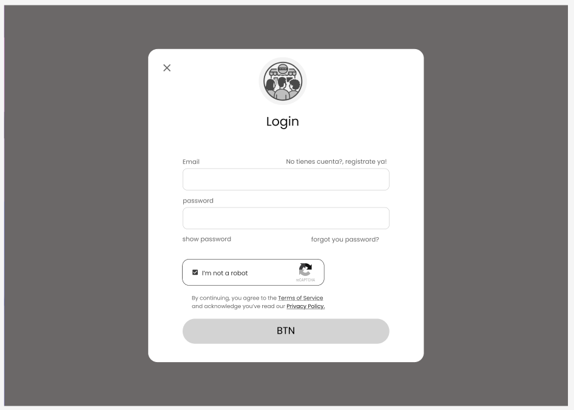

    Wireframe Sing In - Elaboración propia

  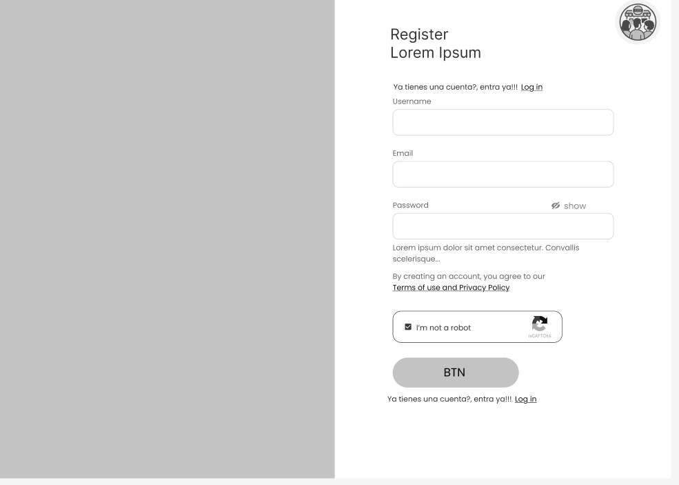

    Wireframe User Register - Elaboración propia

+ **Pagina de inicio del usuario**:

Muestra el perfil del usuario, su codigo QR, y restaurante, el frecuente y el ultio de seleccion anterior. El inicio de la rica coordinacion.

  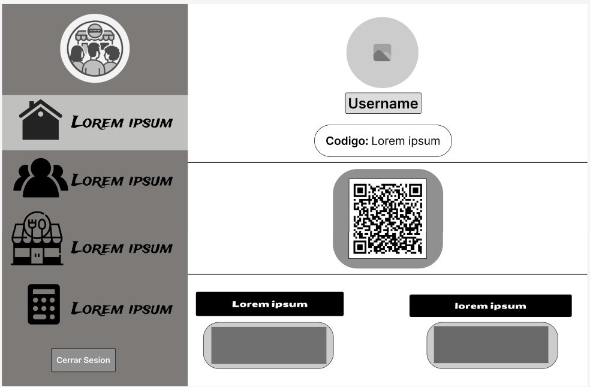

    Wireframe User Homepage - Elaboración propia

+ **Mis Contactos**:

Apartado que permite agregar, ver y seleccionar contactos para el calculo respecto a un grupo

  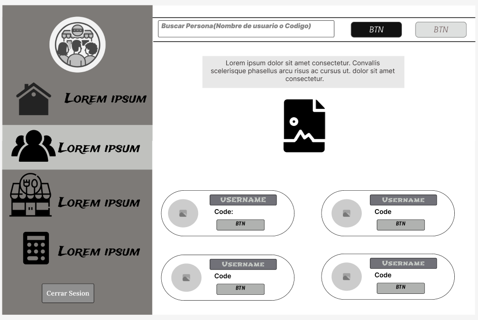

    Wireframe User Add Contact - Elaboración propia

  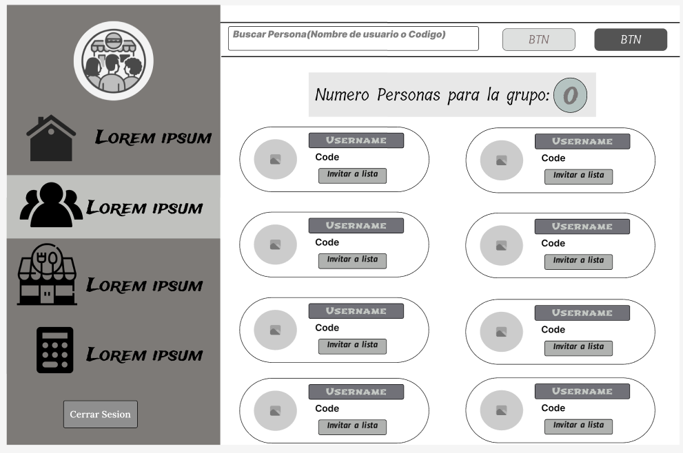

    Wireframe User Contactpage - Elaboración propia

  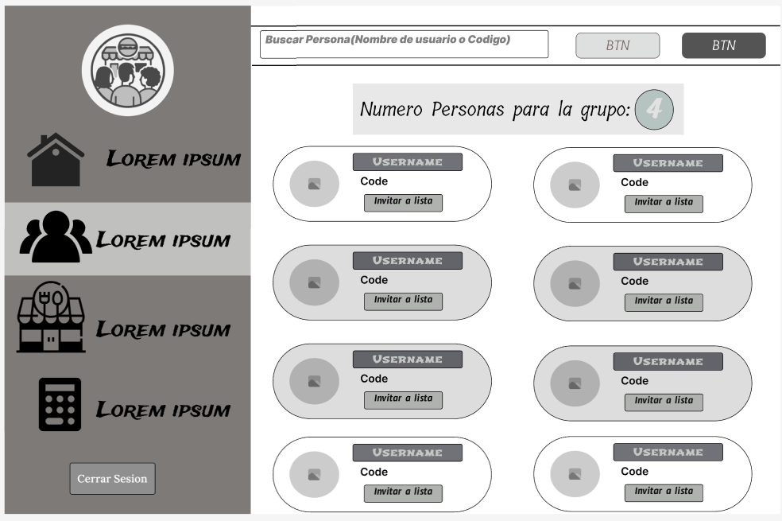

    Wireframe User selection Contact - Elaboración propia

+ **Restaurantes disponibles**:

Muestras los restaurantes disponibles de la aplicacion al usuario y permite su seleccion.

  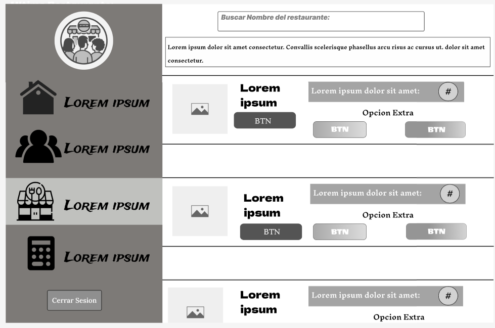

    Wireframe User Restaurantpage - Elaboración propia

  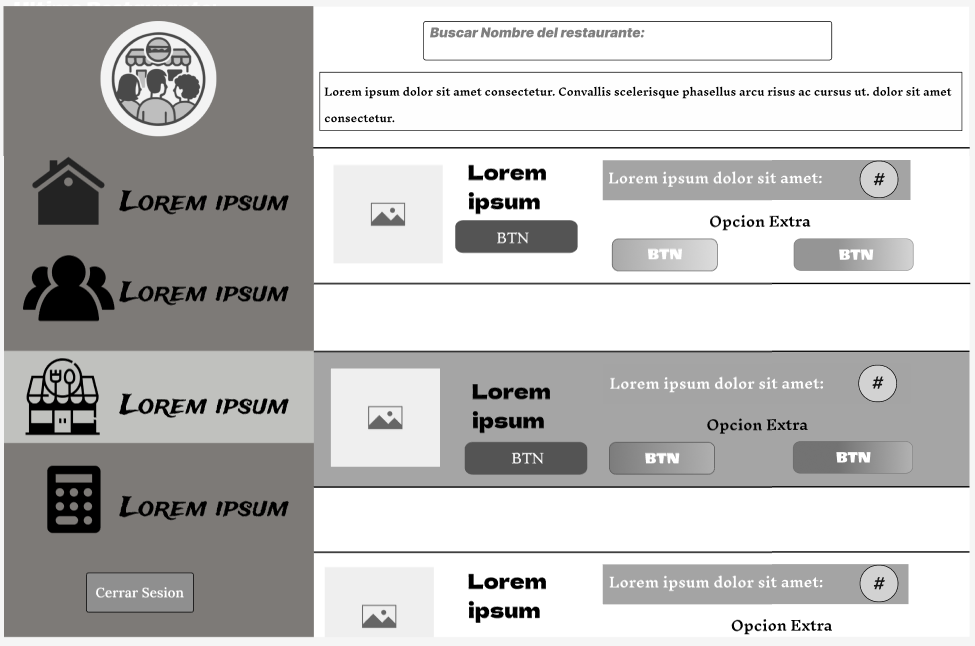

    Wireframe User selection Restaurant - Elaboración propia

+ **Realizar Calculo**:

Formula el calculo respecto al restaurante mas cercano en proporcion a la hubicacion de las personas del grupo.

  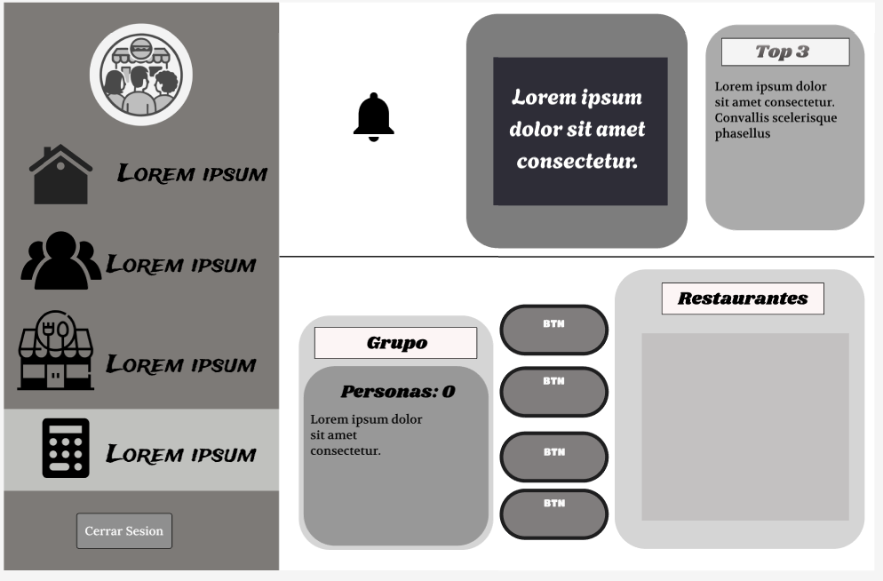

    Wireframe User Calculationtpage - Elaboración propia

  

    Wireframe User Run Calculation - Elaboración propia

  

### 4.4.2. Web Applications Wireflow Diagrams.

https://miro.com/welcomeonboard/WTlMa2lsTU0vVkMyM1Rsc1NYeUNuTURnaXIyV2E5Um43SEpLYmQzYkppOWQ1dzlLVTljQzlvYmxtc0pmWnJXb3E0TXJwU0FCckNtUCtrMll5M3Evb1ZtMFNpYUMwRGdmT1BoaEw2V0pmU2xWM1F0YUVmVmRwdEVzWVlFT2ZBd1FBd044SHFHaVlWYWk0d3NxeHNmeG9BPT0hdjE=?share_link_id=503529665227

  

+ **Wireflow 1: Login / Registrarse**

**User Goal:** Como nuevo usuario, quiero ingresar o crear una cuenta, para acceder a la plataforma y ustilizar sus herramientas.

**User Persona:** Comensales

**Flujo:** El usuario accede a la landing page y hace clic en “iniciar sesion” desde arriba del logotipo. Si ya tiene cuenta, introduce su correo y contraseña afiliada a esa cuenta. Si es nuevo, completa el formulario correspondiente con el nombre de usuario, correo y contraseña. Tras completar el proceso, es redirigido automáticamente a su pagina de perfil.

  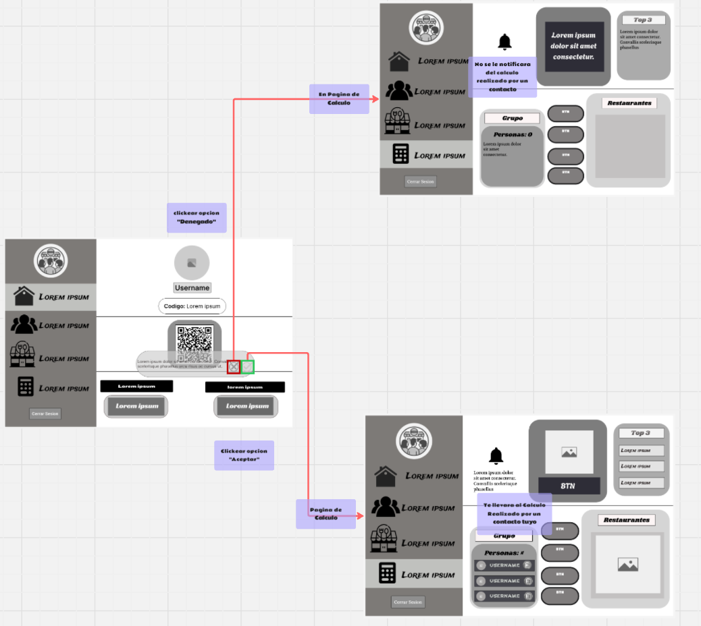

    Wireflow Login y Register - Elaboración propia

+ **Wireflow 2: Agregar a nueva persona**

**User Goal:** Como usuario, quiero agregar a una nueva persona de la plataforma de forma efectiva.

**User Persona:** Comensales

**Flujo:** Desde su perfil ingresa a la seccion de "Contactos" para luego buscar a la persona por medio de su nombre, codigo o para rapides, escaneo de QR y finalmente manda la solicitud.

  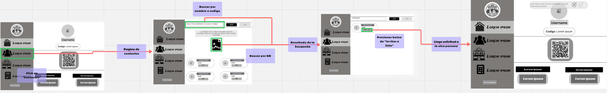

    Wireflow Agregar a nueva persona  - Elaboración propia

+ **Wireflow 3: Cambiar Restaurante durante el calculo**

**User Goal:** Como usuario, quiero cambiar de restaurante tanto antes como durante el calculo para no volver a crear la lista.

**User Persona:** Comensales

**Flujo:** Desde su perfil ingresa a la seccion de "Contactos" para seleccionar a las personas para un grupo, luego ir a la seccion de "Restaurantes" para elegir a cual ir, luego van a la seccion de "Calculo" para proceder con el calculo, luego si se desea cambiar de restaurante, presione el boton 2 que le permitira editar el restaurante, para luego volver a la seccion de "Calculo" y seguir realizando su el procedimiento. 

  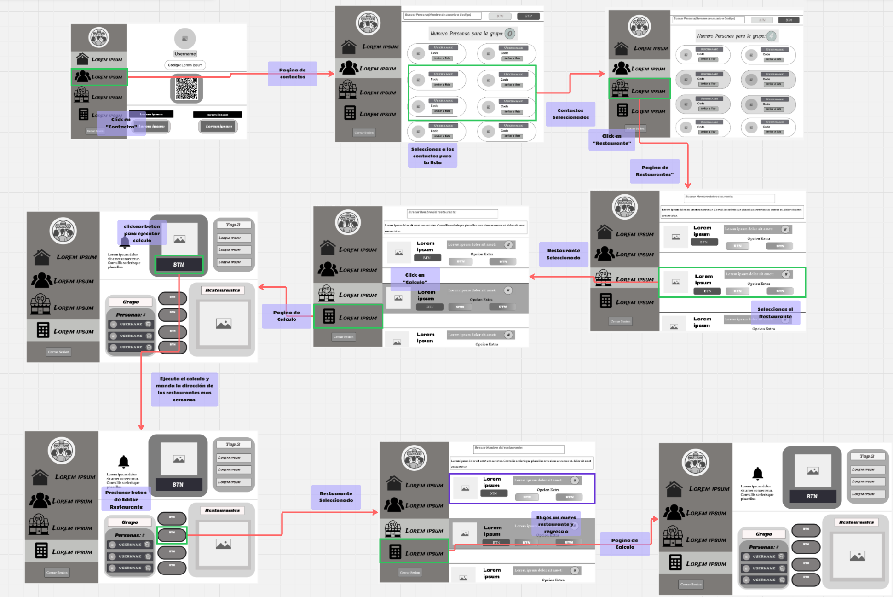

    Wireflow Cambiar Restaurante durante el calculo  - Elaboración propia

+ **Wireflow 4: Aceptar o Denegar Calculos de otra personas**

**User Goal:** Como usuario, quiero aceptar o denegar las calculos realizados de otras personas que me involucren.

**User Persona:** Comensales

**Flujo:** Desde su perfil se le notificara si una persona de contectos lo puso en su lista de calculo, si presiona en el boton de si, lo llevara en la seccion de "Calculo" donde vera los resultados hecho por la persona para ir a un restaurante, en caso que presione el boton de no, no se le llevara a la seccion de "Calculo" como tampoco se le aparecera los datos de dicho calculo.

  

    Wireflow Aceptar o Denegar Calculos de otra personas - Elaboración propia

  

### 4.4.3. Web Applications Mock-ups.

A continuacion los siguientes Mock-ups fueron realizados en base a los wireframes anteriormente hechos. Representan fielmente la manera en la que
 nuestros usuarios podrán apreciar la aplicación web.

https://www.figma.com/design/Iw07d6r56Nxk6swaIVWRw5/Untitled?node-id=0-1&p=f&m=draw

  

+ **Iniciar Sesión / Registrarse**:

Permite a nuevos usuarios crear una cuenta para la aplicacion, y a usuarios existentes ingresar con sus correos para acceder a su perfil.

  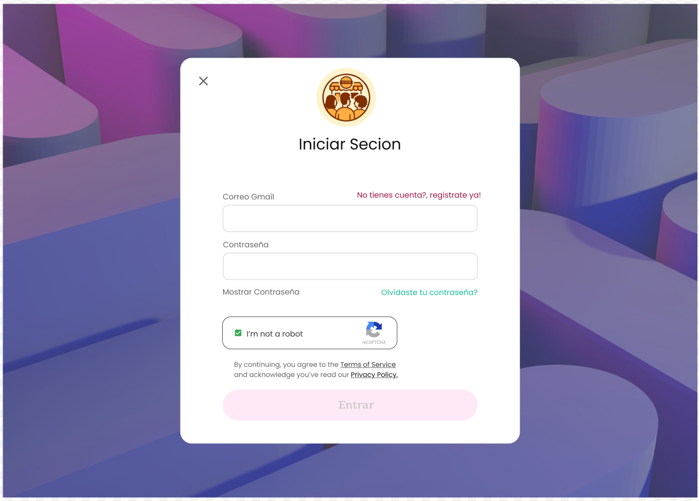

     Web Applications Mock-ups Login - Elaboración propia

  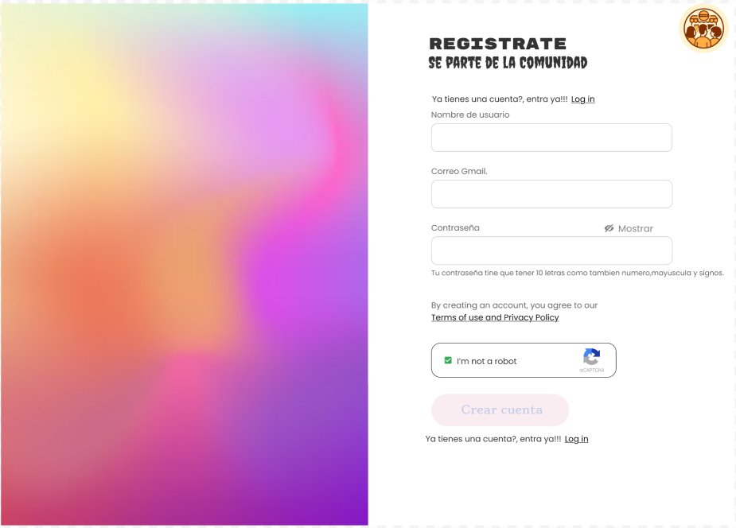

    Web Applications Mock-ups User Register - Elaboración propia

+ **Pagina de inicio del usuario**:

Muestra el perfil del usuario, su codigo QR, y restaurante, el frecuente y el ultio de seleccion anterior. El inicio de la rica coordinacion.

  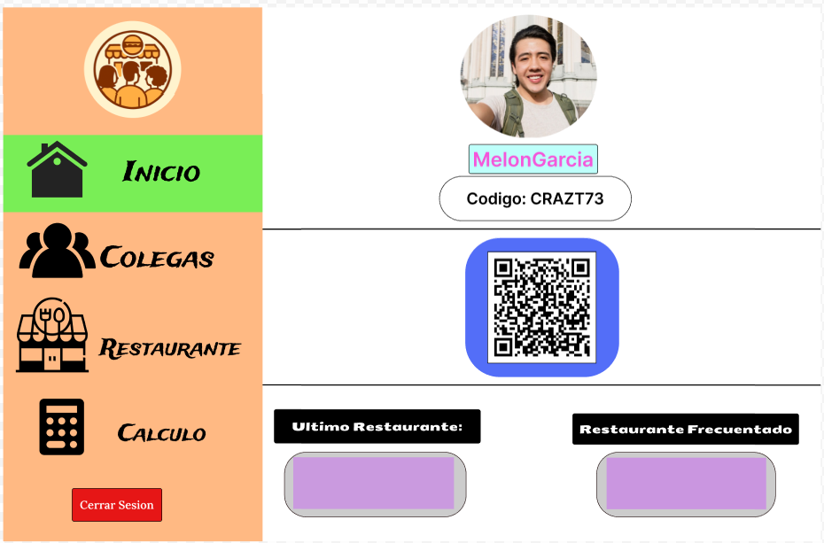

    Web Applications Mock-ups User Homepage - Elaboración propia

+ **Mis Contactos**:

Apartado que permite agregar, ver y seleccionar contactos para el calculo respecto a un grupo

  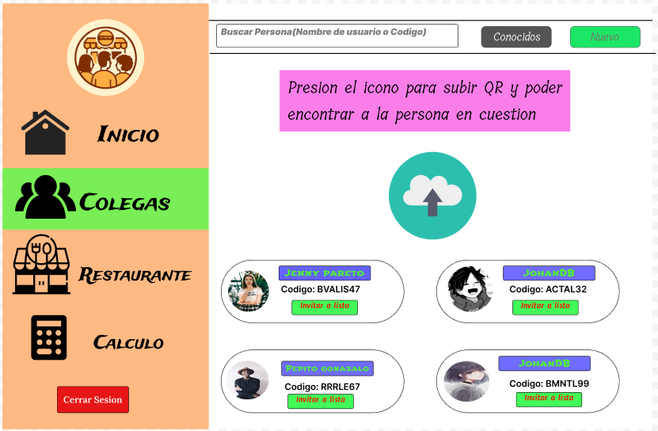

    Web Applications Mock-ups User Add Contact - Elaboración propia

  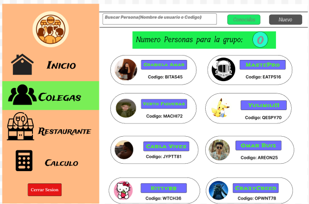

    Web Applications Mock-ups User Contactpage - Elaboración propia

  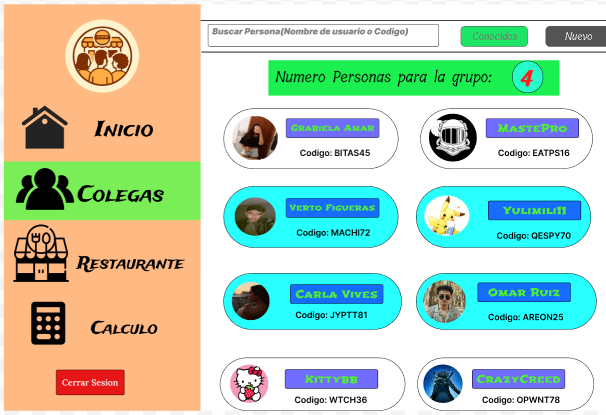

    Web Applications Mock-ups User selection Contact - Elaboración propia

+ **Restaurantes disponibles**:

Muestras los restaurantes disponibles de la aplicacion al usuario y permite su seleccion.

  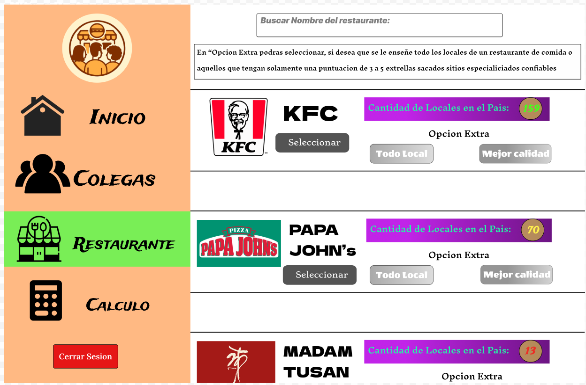

    Web Applications Mock-ups User Restaurantpage - Elaboración propia

  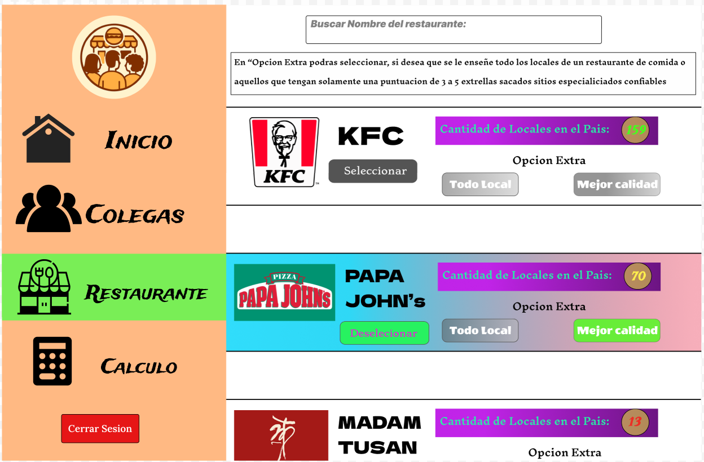

    Web Applications Mock-ups User selection Restaurant - Elaboración propia

+ **Realizar Calculo**:

Formula el calculo respecto al restaurante mas cercano en proporcion a la hubicacion de las personas del grupo.

  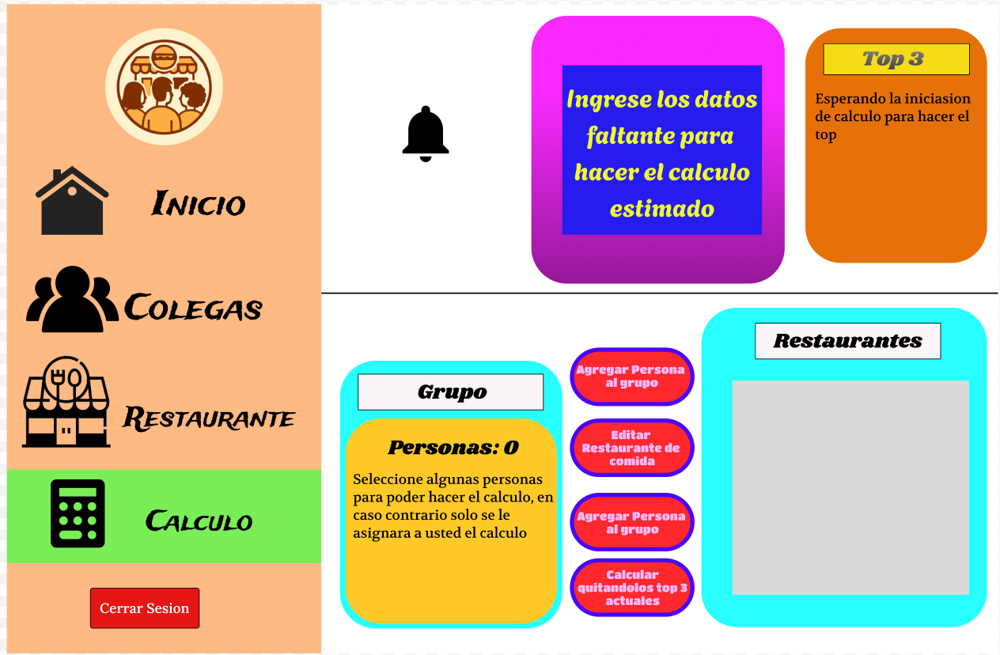

    Web Applications Mock-ups User Calculationtpage - Elaboración propia

  

    Web Applications Mock-ups User Run Calculation - Elaboración propia

  

### 4.4.4. Web Applications User Flow Diagrams.

Los siguientes User Flow Diagrams se elaboraron correspondientemente a los WireFlows previamente hechos y representan los pasos que seguirán
 nuestros usuarios a través de la aplicación.

https://miro.com/welcomeonboard/OW1Ea3dxNDdNSjVDQ3M0TGpsUUNwMUFnWkUrUU1ya1JyTkYzUEtwUG5aa3IzelFOTmYxcG1sdzRwT1M4cU44eFFVYzM2aFZrdEpFK1BkcjdiTmxxQmxtMFNpYUMwRGdmT1BoaEw2V0pmU2w5bzlsQmNia0UxUzNPV2wvdE91SjhzVXVvMm53MW9OWFg5bkJoVXZxdFhRPT0hdjE=?share_link_id=362530360227

  

+ **User Flow Diagram 1: Login / Registrarse**

**User Goal:** Como nuevo usuario, quiero ingresar o crear una cuenta, para acceder a la plataforma y ustilizar sus herramientas.

**User Persona:** Comensales

**Flujo:** El usuario accede a la landing page y hace clic en “iniciar sesion” desde arriba del logotipo. Si ya tiene cuenta, introduce su correo y contraseña afiliada a esa cuenta. Si es nuevo, completa el formulario correspondiente con el nombre de usuario, correo y contraseña. Tras completar el proceso, es redirigido automáticamente a su pagina de perfil.

  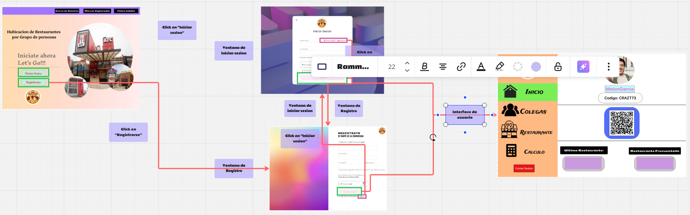

    Web Applications User Flow Login y Register - Elaboración propia

+ **User Flow Diagram 2: Agregar a nueva persona**

**User Goal:** Como usuario, quiero agregar a una nueva persona de la plataforma de forma efectiva.

**User Persona:** Comensales

**Flujo:** Desde su perfil ingresa a la seccion de "Contactos" para luego buscar a la persona por medio de su nombre, codigo o para rapides, escaneo de QR y finalmente manda la solicitud.

  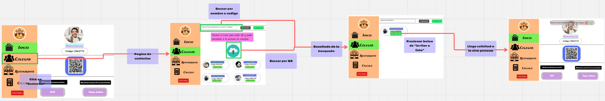

    Web Applications User Flow Agregar a nueva persona  - Elaboración propia

+ **User Flow Diagram 3: Cambiar Restaurante durante el calculo**

**User Goal:** Como usuario, quiero cambiar de restaurante tanto antes como durante el calculo para no volver a crear la lista.

**User Persona:** Comensales

**Flujo:** Desde su perfil ingresa a la seccion de "Contactos" para seleccionar a las personas para un grupo, luego ir a la seccion de "Restaurantes" para elegir a cual ir, luego van a la seccion de "Calculo" para proceder con el calculo, luego si se desea cambiar de restaurante, presione el boton 2 que le permitira editar el restaurante, para luego volver a la seccion de "Calculo" y seguir realizando su el procedimiento. 

  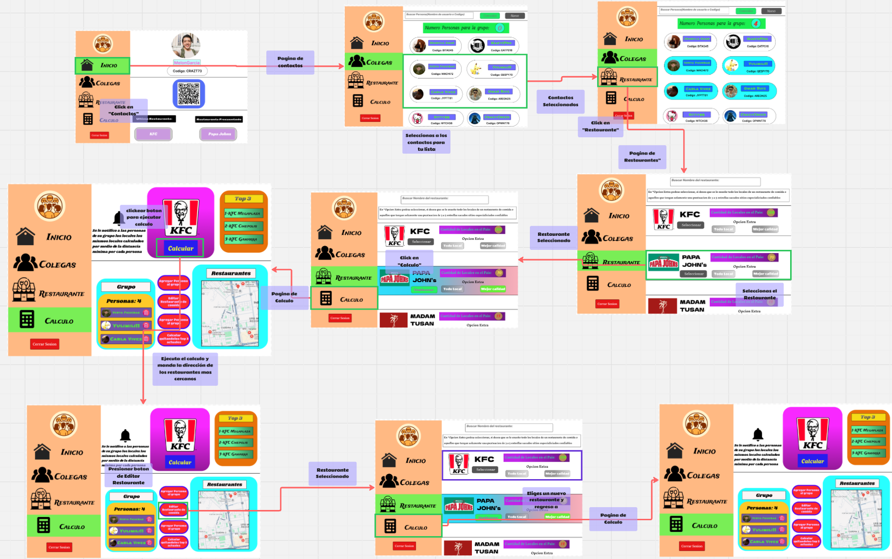

    Web Applications User Flow Cambiar Restaurante durante el calculo  - Elaboración propia

+ **User Flow Diagram 4: Aceptar o Denegar Calculos de otra personas**

**User Goal:** Como usuario, quiero aceptar o denegar las calculos realizados de otras personas que me involucren.

**User Persona:** Comensales

**Flujo:** Desde su perfil se le notificara si una persona de contectos lo puso en su lista de calculo, si presiona en el boton de si, lo llevara en la seccion de "Calculo" donde vera los resultados hecho por la persona para ir a un restaurante, en caso que presione el boton de no, no se le llevara a la seccion de "Calculo" como tampoco se le aparecera los datos de dicho calculo.

  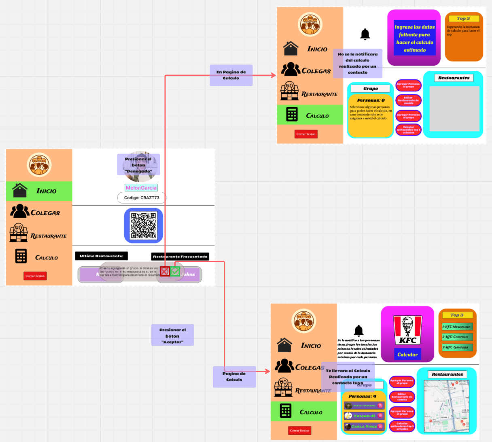

    Web Applications User Flow Aceptar o Denegar Calculos de otra personas - Elaboración propia

  

## 4.5. Web Applications Prototyping.

## 4.6. Domain-Driven Software Architecture.

### 4.6.1. Software Architecture Context Diagram.

### 4.6.2. Software Architecture Container Diagrams.

### 4.6.3. Software Architecture Components Diagrams.

## 4.7. Software Object-Oriented Design.

### 4.7.1. Class Diagrams.

### 4.7.2. Class Dictionary.

| Clase        | Descripción                                                                                                                                                 |
| ------------ | ----------------------------------------------------------------------------------------------------------------------------------------------------------- |

## 4.8. Database Design.

### 4.8.1. Database Diagram.

# Capítulo V: Product Implementation, Validation & Deployment

## 5.1. Software Configuration Management.

A continuación, se describe el proceso por el cual organizamos, gestionamos y controlamos los cambio de desarrollo de LocalFood.

### 5.1.1. Software Development Environment Configuration.

Gestión de las necesidades

- Trello: Herramienta utilizada para gestionar el flujo de trabajo de proyectos principalmente marcos en red de trabajos ágiles. El segmento para visualizar y actualizar el estado real de las tareas e historias de usuario pertenecientes al sprint a desarrollado.

  Ruta de referencia: https://trello.com/es

Diseño UX/UI

- Figma: Plataforma de elaboración de prototipos y edición gráfica, principalmente utilizada para el diseño digital. En el caso del proyecto, se utilizó para el prototipado de la aplicación y sus versiones de Desktop y Mobile Web Browser.

  Ruta de referencia: https://www.figma.com/login 

- Lucidchart: Aplicación para diagramar flujos. Será empleado para el diseño de flujos de cable, flujos de usuario y el diagrama de clases asociadas a la aplicación.

  Ruta de referencia: https://www.lucidchart.com/ 
  
Desarrollo de software

- Visual Studio Code: El equipo de trabajo seleccionó un entorno de desarrollo integrado (IDE) para la creación y compilación de los factores de control por dominio. Este IDE aporta valor al proyecto, ya que permite incorporar extensiones útiles, ofrece soporte para la edición de texto en diversos lenguajes de programación, es compatible con múltiples sistemas operativos y brinda otros beneficios adicionales.

  Ruta de referencia: https://code.visualstudio.com/ 

- HTML5: HyperText Markup Language, o siglas por sus HTML, es un lenguaje de etiquetado para páginas web. Será empleado en el desarrollo del proyecto para la presentación del contenido en la aplicación.

  Ruta de referencia: https://www.w3schools.com/html/html5-syntax.asp
  
- CSS: Hojas de estilo en cascada es un lenguaje que maneja el diseño y presentación de las páginas web, el que va de la mano con HTML.

  Ruta de referencia: https://google.github.io/styleguide/htmlcssguide.html 

Implementación de software

- Git: Una herramienta de control de versiones que facilitan el registro y la gestión de las versiones distintas del programa. Su propósito es mantener un historial de cambios y simplificar el corrección de errores. Los integrantes del equipo A través de la línea de comandos en sus sistemas locales.

  Ruta de referencia: https://git-scm.com/ 

  Documentación y gestión de proyectos de software

- Github: Una plataforma en la nube que hospedará los repositorios de código del proyecto. Permitir la colaboración en tiempo real y la revisión de las contribuciones de cada miembro del equipo. Los integrantes del equipo se puede acceder a través de sus navegadores web.

  Ruta de referencia:https://github.com/ 

### 5.1.2. Source Code Management.

El proyecto utiliza el flujo de trabajo GitFlow para la gestión de versiones y GitHub como plataforma de alojamiento y administración del código. A continuación, se presenta cómo se implementa este modelo.

**Flujo de trabajo GitFlow**

Flujo de Trabajo GitFlow para el Desarrollo de LocalFood

El proyecto adopta el modelo GitFlow, una estrategia de ramificación basada en Git diseñada para optimizar la colaboración y el control de versiones en equipos de desarrollo. Este enfoque organiza el trabajo en ramas específicas, una integración fluida de nuevas funcionalidades y una gestión eficiente de lanzamientos.

Ramas Principales

- main(principal)

  - Contiene el código estable y listo para la producción, correspondiente a las versiones oficiales de LocalFood

  - Cada release se marca con etiquetas semánticas (ej. v1) para facilitar el rastreo y la aplicación de las actualizaciones.

- develop(rama de desarrollo)

  - Alberga la versión más reciente en estado de preproducción, donde se integran todas las funcionalidades completadas.

  - Funciona como base para pruebas internas y ajustes previos a su fusión con main.

Ramas de Soporte

- chapter/\*(ramas de documentación)

  - Permite trabajar por secciones la documentación 

  - Al completarse un capítulo, la rama se fusiona con la rama develop para luego llegar a main

- feature/\*(ramas de características)

  - Cada nueva funcionalidad se desarrolla en un rama independiente (ej. feature/login), derivada de develop.

  - Perfilo trabajo paralelo sin afectar la base de los códigos principales hasta su revisión y aprobación.

- release/\*(ramas de lanzamiento)

  - Preparadas para versiones específicas, permiten pruebas finales y corrección de bugs antes de su despliegue en main.

- hotfix/\*(ramas de las urgencias)

  - Resuelven errores desprendentes en producción, derivando directamente de mainy fusión tanto en maincomo en develop.

### 5.1.3. Source Code Style Guide & Conventions.

Descripción:

1.  HTML
    Estructura básica

      <!DOCTYPE html>
      HTM lang = " es ">

 - Reglas generales:
    - Todos los elementos deben estar correctamente cerrados

           (ej. , 

).

     - Usar comillas dobles (" ") en atributos que contengan espacios.

     - Incluir atributos esenciales en imágenes.
              

2.  CSS

Formato:

- Sangría: 2 espacios (sin pestañas).

- Minúsculas en Selectores, propiedades y valores.

- Empiteación en blanco innecesarios y líneas vacías redundantes.

3.  vue.js

Reglas clave:

- Nombres de Compentes: PascalCase(Ej: UserProfile.vue)
- Props: Definir tipos y valores por defecto. 

### 5.1.4. Software Deployment Configuration.

Hemos seleccionado GitHub Pages como plataforma para alojar el sitio web estático del proyecto. A continuación se detalla el proceso completo:

1. **Creación del repositorio en GitHub:**

   - Primero, se debe crear un nuevo repositorio en GitHub. Asegúrate de que el repositorio sea público para que GitHub Pages pueda generar y alojar el sitio.

- Clona el repositorio a tu máquina local para realizar los desarrollos necesarios.
- **Ejemplo:**

git clone https://github.com/LocalFood-Aplicaciones-Web/Project-report.git

2. **Desarrollo del sitio estático:**

- El desarrollo del Landing Page se realiza utilizando HTML, CSS, Tailwind.css , JavaScript y vue.js. Estos archivos deben estar en la raíz del repositorio o en la carpeta docs, dependiendo de la configuración elegida para GitHub Pages.

3. **Configuración de GitHub Pages:**

- Dirígete a la configuración del repositorio en GitHub:
  - Ir a la seccion Settings
  - Desplázate hacia abajo hasta la sección Pages.
  - En el menú desplegable "Source", selecciona la creada gh-pages y la carpeta raíz (/root) o docs/ si los archivos están organizados dentro de esa carpeta.
- Una vez seleccionado, GitHub Pages generará una URL para acceder a tu sitio web.

4. **Verificar el despliegue:**

   - En este caso, el Link del Landing Page desplegado del proyecto LocalFood es:  

## 5.2. Landing Page, Services & Applications Implementation.

### 5.2.1. Sprint 1

Durante el desarrollo Sprint 1 del proyecto LocalFood, el equipo se enfocó en el diseño llamativo y construcción funcional de la Landing Page de la plataforma. Se implementaron las principales las fundamentales secciones informativas, eso incluye el mensaje de bienvenida, los botones de registro y navegación, la sección de amigos para un gruoi, informacion respecto a nosotros y funciones adaptada a cambio de planes.  Además, se trabajó en aspectos fundamentales de interacción como la fijación del encabezado al hacer scroll y la visualización atractiva del interface. El equipo logró realizae la mayoría de las tareas planteadas, dejando solo algunos cosas en proceso de checkeo. Todo el despliegue del Sprint 1 priorizó una navegación llamativa, accesibilidad y fluida en la comunicación hacia los nuevos usuarios.

#### 5.2.1.1. Sprint Planning 1.

<table align="center">
  <tr>
    <td><strong>Sprint #</strong></td>
    <td>1</td>
  </tr>
  <tr>
    <td colspan="2"><strong>Sprint planning Backgroud</strong></td>
  </tr>
  <tr>
    <td><strong>Date</strong></td>
    <td>2025 - 09 -13</td>
  </tr>
  <tr>
    <td><strong>Time</strong></td>
    <td>9:00 am</td>
  </tr>
  <tr>
    <td><strong>Location</strong></td>
    <td>Virtual meet in Google Meet</td>
  </tr>
  <tr>
    <td><strong>Prepared by</strong></td>
    <td>Walter Luis</td>
  </tr>
  <tr>
    <td><strong>Attendes (to planning meeting)</strong></td>
    <td>Sebastian Augusto, Angel Jose, Ivan Fernando, Ariadna Geraldine</td>
  </tr>
  <tr>
    <td><strong>Sprint 0 Review Winter</strong></td>
    <td>No Realizamos una reunión previa debido a que este es nuestro primer sprint</td>
  </tr>
  <tr>
    <td><strong>Sprint 0 Retorspective Summary</strong></td>
    <td>No tuvimos una reunión previa debido a que este es nuestro primer sprint</td>
  </tr>
  <tr>
    <td colspan="2"><strong>Sprint Goal and User Stories</strong></td>
  </tr>
  <tr>
    <td><strong>Sprint 1 Goal</strong></td>
    <td>Entregar una landing page estática que comunique la propuesta de valor de GastroGo, con el objetivo de generar engagement inicial de los usuarios respecto a usar nuestro producto y ofrecer claridad a los comersales. Se considerará logrado cuando la página esté publicada y los visitantes puedan entender el propósito de la plataforma.</td>
  </tr>
  <tr>
    <td><strong>Sprint 1 Velocity</strong></td>
    <td>17</td>
  </tr>
</table>
 

#### 5.2.1.2. Aspect Leaders and Collaborators.

<table align="center">
  <tr>
    <td><strong>Team Member</strong></td>
    <td><strong>GitHub Username</strong></td>
    <td><strong>Contenido y mensajes</strong></td>
    <td><strong>Funcionalidades específicas</strong></td>
    <td><strong>Diseño y Navegación</strong></td>
    <td><strong>Deployment</strong></td>
  </tr>
  <tr>
    <td>Walter Luis, Fajardo Monrroy</td>
    <td>WalterFajardo</td>
    <td>C</td>
    <td>C</td>
    <td>C</td>
    <td>L</td>
  </tr>
  <tr>
    <td>Sebastian Augusto, Gutierrez Santillan</td>
    <td>Yeva</td>
    <td>C</td>
    <td>C</td>
    <td>C</td>
    <td>C</td>
  </tr>
  <tr>
    <td>Ivan Fernando, Sanchez Guevara</td>
    <td>DonFernando1</td>
    <td>C</td>
    <td>C</td>
    <td>L</td>
    <td>C</td>
  </tr>
  <tr>
    <td>Ariadna Geraldine, Poma Muñoz</td>
    <td>InAsui</td>
    <td>L</td>
    <td>L</td>
    <td>C</td>
    <td>C</td>
  </tr>
  <tr>
    <td>Angel Jose Pariona Chacca</td>
    <td>angelitoso-opp</td>
    <td>C</td>
    <td>C</td>
    <td>C</td>
    <td>C</td>
  </tr>
</table>
 

#### 5.2.1.3. Sprint Backlog n.

Descripción

Durante el primer sprint backlog, el equipo tuvo el deber de realizar y completar la landing page. La plataforma usada para la organización y gestiónar a los integrantes del equipo fue Trello. Ya quela plataforma nos permitió la división de todas las user stories en tareas manejables, para luego asi asignarlas a los diferentes miembros según sus diferentes habilidades. el objetivo principal del sprint era construir en su totalidad la landing page, logrando que sea llamativo y que se funcional.

  Sprint Backlog 1 Trello - Elaboración propia

 
link al trello: https://trello.com/invite/b/68c7d580d1d41d4f3acf95c2/ATTIe6344c6d324fbbb059ac41bfddd60e6d7988396B/localfood
<table border="1" cellspacing="0" cellpadding="5">
    <thead>
        <tr>
            <th>Sprint #</th>
            <th colspan="8">Sprint 1</th>
        </tr>
        <tr>
            <th colspan="2">User Story</th>
            <th colspan="7">WorkItem-Task</th>
        </tr>
        <tr>
            <th>US-ID</th>
            <th>Title</th>
            <th>ID</th>
            <th>Title</th>
            <th>Description</th>
            <th>Acceptance Criteria</th>
            <th>Estimation (Hours)</th>
            <th>Assigned To</th>
            <th>Status</th>
        </tr>
    </thead>
    <tbody>
        <tr>
            <td>US01</td>
            <td>Ver notificaciones de amigos/contactos</td>
            <td>UT01</td>
            <td>Crear mensaje saliente de las notificaciones</td>
            <td><strong>Como nuevo usuario</strong>, quiero ver las notificaciones de la aplicacion<strong>para sbaer si me estan mandando solicitud de amista o estan calculando un grupo</strong>.</td>
            <td>
                <strong>Escenario 1:</strong> Given que estoy en cualquier parte de la pagina, When veo las notificaciones, Then puedo ver el usuario de la persona respecto a calculos o me envie solicitud de amistad. 
            </td>
            <td>5</td>
            <td></td>
            <td>In-Process</td>
        </tr>
        <tr>
            <td>US02</td>
            <td>Cambiar de restaurante durante el calculo</td>
            <td>UT02</td>
            <td>Funcionalidad "Editar Restaurante de Comida"  </td>
            <td><strong>Como usuario</strong>, quiero cambiar de resturante durante el calculo<strong>para poder adecuar el destinos a cambios de planes</strong>.</td>
            <td>
                <strong>Escenario 1:</strong> Given que soy un usuario que coordina con si grupo cuando veo que deciden cambiar de restaurante luego de haber coordinado uno, When acceda a Restaurante o Calculo, Then se cambia el restaurante para el calculo en la seccion de restaurante o en su defecto se presiona un boton en la seccion de calculo donde te llevara a la seccion de restaurantes. 
                <strong>Escenario 2:</strong> Given que soy un usuario que ya empezo a calcular con un restaurante para mi grupo, When cambiamos de opinion, Then puedo presionar el boton de cambiar restaurante en cambio y sin forma de nuevo el grupo.
            </td>
            <td>9</td>
            <td>Ariadna Poma</td>
            <td>In-Process</td>
        </tr>
        <tr>
            <td>US03</td>
            <td>Ignorar los cálculos de otra gente</td>
            <td>UT03</td>
            <td>Boton denegar en las notificaciones</td>
            <td><strong>Como usuario</strong>, quiero poder ignorar o rechazar los calculos, <strong>no afectar el calculo de mis amigos como no tener muchas notificaciones </strong>.</td>
            <td>
                <strong>Escenario 1:</strong> Given que soy un usuario que recibe notificaciones de calculos que me incluyan,When acceda a la pagina con la notificacion ,Then presiono en el boton de denegar para que no me aparezca dicho calculo. 
            </td>
            <td>3</td>
            <td>Fernando Sanchez</td>
            <td>In-Process</td>
        </tr>
        <tr>
            <td>US04</td>
            <td>Implementar amigos a un lista ya creada</td>
            <td>UT04</td>
            <td>boton de "añadar a lista ya creada" </td>
            <td><strong>Como usuario</strong>, quiero poder implementar mas amigos en una lista ya creada,<strong>para no tener que volverla a crear</strong>.</td>
            <td>
                <strong>Escenario 1:</strong> Given este en el apartado de calculo con la lista ya creada,When este en el apartado de calculo con la lista ya creada ,Then presiono la opcion de incluir miembro a la lista ya creada y empiezo el calculo. 
            </td>
            <td>6</td>
            <td>Walter Fajardo</td>
            <td>In-Process</td>
        </tr>
        </tbody>
</table>

#### 5.2.1.4. Development Evidence for Sprint Review.

En esta sección, se presentan los commits realizados en el repositorio de la landing page en GitHub

| **Repository**   | **Branch** | **Commit Id**                               | **Commit Message**                                                        | **Usuario**        | **Commited on (Date)** |
| ---------------- | ---------- | ------------------------------------------- | ------------------------------------------------------------------------- | ------------------ | ---------------------- |
| project-report   | develop    | 2898421e20e874ff7161b86fd420330db68e3b5f    | Update README.md                                                           | angelitoso-opp     | yesterday              |
| project-report   | develop    | f10c28b841273428d25e17d789156e08b635627a    | Add files via upload                                                       | angelitoso-opp     | yesterday              |
| project-report   | develop    | 13326d51af42be2e5d5271ed91d51c0c763037bf    | Update README.md                                                           | angelitoso-opp     | yesterday              |
| project-report   | develop    | 56f0c41d88e8a8efd5e88aae0b3e496282ad8a9a    | doc: Implement data about a student and complete the StudentOutcome        | DonFernando1       | yesterday              |
| project-report   | develop    | 3321f4fd25202612fc53253ca687283a8d8842b0    | Merge pull request #7 from LocalFood-Aplicaciones-Web/docs/chapter2-v1     | WalterFajardo      | 2 days ago             |
| project-report   | develop    | 303b6eaad32b2b89178c82494bceb72e1ac1ec85    | docs: add user persona for food stall owner segment                        | WalterFajardo      | 2 days ago             |
| project-report   | develop    | 54738091ddf978c492e2df782582898626726eda    | docs: add user persona for customer segment                                | WalterFajardo      | 2 days ago             |
| project-report   | develop    | 7ca03b573370d85e64c22d7939c6cb934b20668d    | Update README.md                                                           | angelitoso-opp     | 3 days ago             |
| project-report   | develop    | a00ee47491013a5a03283f4a89587edc74eeb691    | Merge pull request #5 from LocalFood-Aplicaciones-Web/docs/chapter2-v1     | InAsui             | 5 days ago             |
| project-report   | develop    | 763ee43f369d81fef3cb9301997b5069c1dafaf2    | docs: update Section 2.2.1 - Interview design                              | InAsui             | 5 days ago             |
| project-report   | develop    | 4eca74e525972909a0206bc7bd5a4cb8f6c2e633    | docs: update Section 2.2.1 - Interview design                              | InAsui             | 5 days ago             |
| project-report   | develop    | 7b6ad8fafb7c5b1fde7719ea83dd5f75e4128c38    | docs: update 2.2.1 - Interview design                                      | InAsui             | 5 days ago             |
| project-report   | develop    | 2231b8800f9d274e9d2d794649a0d05d93c64b0e    | docs: update Section 2.2.1 - Interview design                              | InAsui             | 5 days ago             |
| project-report   | develop    | e0faab0a33598f1e50cd9e0bbe5ad6491c2e4331    | Merge pull request #4 from LocalFood-Aplicaciones-Web/docs/chapter1-v1     | InAsui             | 5 days ago             |
| project-report   | develop    | a5039fc63aec8cda91ebc942c41caa1121b66b00    | docs: update Section 1.3 - target segments                                 | InAsui             | 5 days ago             |
| project-report   | develop    | 2dd835bfc09cdd25631227806c9465045df49a62    | docs: update Section 1.2.2.4 - Lean UX Canvas.                             | InAsui             | 5 days ago             |
| project-report   | develop    | c8bfc792f6387c3905456adb4ae8df96bacdad5c    | Add files via upload                                                       | InAsui             | 5 days ago             |
| project-report   | develop    | 82fb2d0f91a6783a7584a0fab364a62c04107861    | docs: update Section 1.2.2.2 - Lean UX Assumptions.                        | InAsui             | 5 days ago             |
| project-report   | develop    | 6babe665824838ae8151e8680454b714765adfd4    | docs: update Section 1.2.2.1 - Lean UX Problem Statements                  | InAsui             | 5 days ago             |
| project-report   | develop    | 8babd6096fbd2be58fffaf90b9fb549630673f2c    | docs: update Section 1.2.1 - background and issues                         | InAsui             | 5 days ago             |
| project-report   | develop    | 21d171b2e2c0d21c9ad078c8bfe039a3137c66b0    | docs: update chapter 1                                                     | InAsui             | 5 days ago             |
| project-report   | develop    | 896e04acf708a94286feb4d7ba192c71021b797e    | Merge pull request #3 from LocalFood-Aplicaciones-Web/develop              | WalterFajardo      | last week              |
| project-report   | develop    | cc0440df631ee99fb3c4312a09b57d99bc1a7fa8    | Merge pull request #2 from LocalFood-Aplicaciones-Web/docs/chapter2-v1     | WalterFajardo      | last week              |
| project-report   | develop    | 9184f16b004075fddd9c6a92b65a928fd1be6f3d    | Merge pull request #1 from LocalFood-Aplicaciones-Web/docs/chapter2-v1     | WalterFajardo      | last week              |
| project-report   | develop    | c35eb7f3489f0057f3c0385871c39051b3f5c35f    | docs: Include interview design, strategies, and competitive analysis section | WalterFajardo    | last week              |
| project-report   | develop    | d237f106d27be286bfa1c4777b06139f0a0145ea    | docs: add university logo and create assets folder                         | WalterFajardo      | last week              |
| project-report   | develop    | 5ac6de5ca388fd704b19362199f7c4e1afad2b4e    | docs: add initial document template                                        | WalterFajardo      | last week              |
| project-report   | develop    | a1c81cb88b24584eb17855218dc9a766a7fa2ab3    | Initial commit                                                             | WalterFajardo      | last week              |

#### 5.2.1.5. Execution Evidence for Sprint Review.

Se logro desarrollar y desplegar la landing page del proyecto. A continuación, presentamos capturas de las vistas implementadas.

- **XXXXX:**:

  

- **XXXXX:**:

  

- **XXXXX:**:

  

- **XXXXX:**:

  

- **Evidencia de login funcionando con estilos**:  
  

- **Evidencia de register funcionando con estilos**:  
  

- **Evidencia de forgot-password desplegado correctamente**:  
  

---

#### 5.2.1.6. Services Documentation Evidence for Sprint Review.

Descripción: En este sprint 1 se desarrollo la landing page, por lo que no hay evidencias del empleo de web services.

#### 5.2.1.7. Software Deployment Evidence for Sprint Review.

Durante el primer sprint, desarrollamos y desplegamos la landing page del proyecto.

pasos para el despliegue:

1. Creación del Repositorio en GitHub: Iniciamos creando un repositorio dedicado en GitHub para nuestro proyecto de landing page.

2. Configuración de la Rama de despliegue: Aseguramos que la rama principal del repositorio se llamara gh-pages, ya que GitHub Pages toma esta rama como base para el despliegue automático.

3. Generación del Enlace de GitHub Pages: Navegamos a la sección "Pages" en la configuración del repositorio en GitHub. Configuramos la fuente de GitHub Pages para que tomara el contenido de la rama gh-pages.

4. Despliegue Automático: GitHub Pages automáticamente detectó los cambios en la rama gh-pages y desplegó la landing page en la URL proporcionada por GitHub Pages.

#### 5.2.1.8. Team Collaboration Insights during Sprint.

Durante el Sprint 1, el equipo de desarrollo en implementar todas las funcionalidades de la landing page y la realización del documento.

#### Colaboración y Desarrollo de Actividades

1. **Asignación de Tareas**:

2. **Evidencia de commits**:

Repositorio:

**Documento**
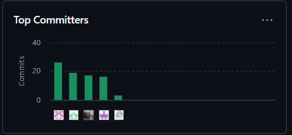

3. **Evidencia de Nertwork**:

Repositorio:

**Documento**
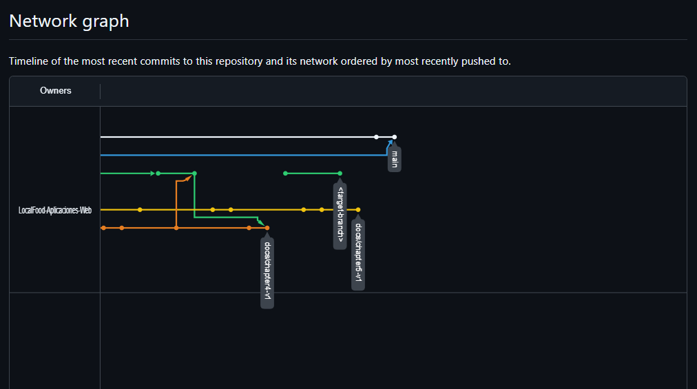

4.**Contributions**

Repositorios:

**Documento**

**Landing Page**

